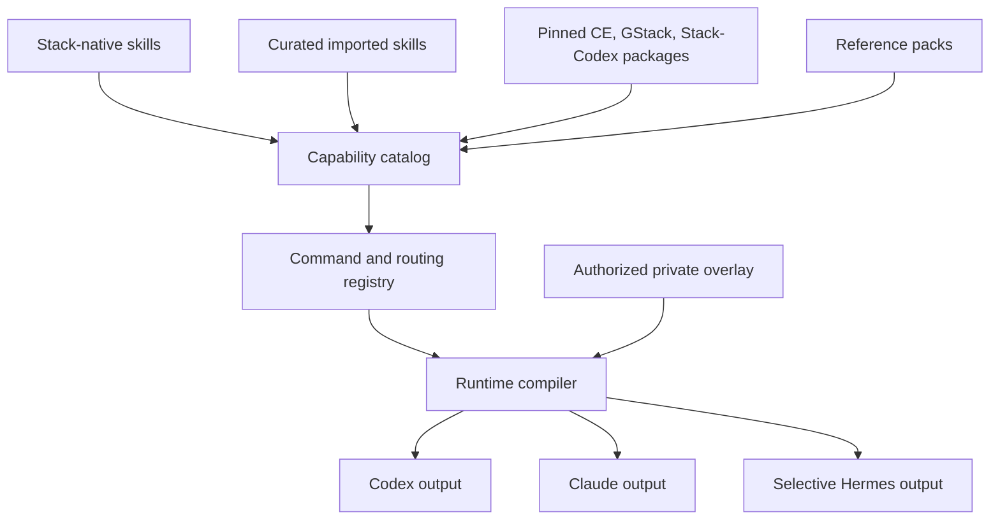
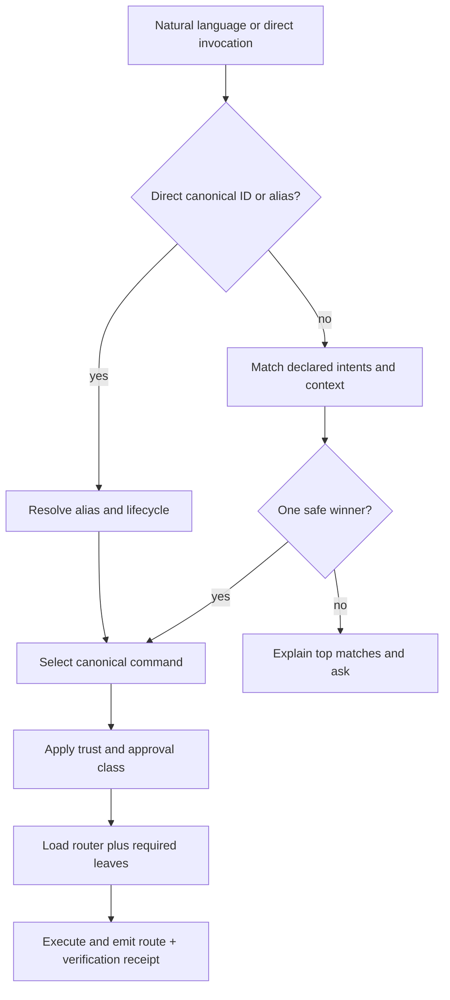
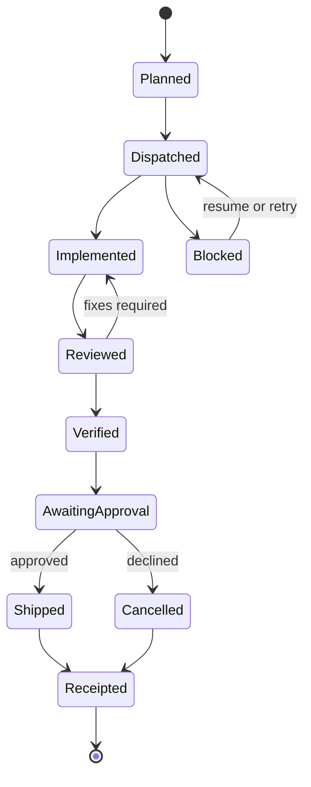

# Stack Skill and Command Architecture - Plan

## Goal Capsule

**Outcome:** Stack becomes Maroun's complete, versioned working environment for Claude Code and Codex: a coherent set of product, design, engineering, orchestration, review, QA, shipping, learning, and maintenance capabilities with one understandable command architecture.

**User-visible promise:** Maroun can ask naturally or invoke a command directly, understand which capability was selected, use the same logical workflow in Claude and Codex, and clone the system onto a new machine without reconstructing it from local folders.

**Authority order:** Maroun's explicit request overrides Stack routing; Stack's canonical command registry overrides router prose; package-native commands remain available as documented aliases; runtime-specific exceptions must be declared rather than inferred.

**Execution boundary:** Roadmap Phase 1 organizes and ships the existing skill estate. Roadmap Phase 2 adds bookmark ingestion, candidate promotion, and continuous updates. No ingestion feature may redefine the taxonomy, command tree, or package ownership established in Phase 1.

**Stop conditions:** Do not declare Phase 1 complete while capabilities remain unclassified, command collisions remain implicit, Compound Engineering/GStack/Stack-Codex are only prose dependencies, or a clean clone cannot route and discover the same active capabilities in Claude and Codex.

---

## Product Contract

### Summary

Stack is the source of truth for how Maroun works with coding agents. It includes the skills and workflows required to explore, plan, design, build, delegate, review, verify, ship, learn, and maintain software. Design and implementation are major domains, but not the product boundary.

Stack does not replace Compound Engineering, GStack, Codex, Claude, or Hermes. It organizes them, pins their upstream packages, supplies Stack-native workflows, resolves command overlap, and publishes a consistent runtime surface.

### Problem Frame

The repository currently contains useful skills but not a deliberate architecture. The live catalog has 136 records, yet every record is `domain: unclassified` and `artifact_type: skill`; 132 are candidates and four are deprecated. Eighty-four current skill directories contain callable `SKILL.md` files, while nested collections and generated manifests raise the catalog count.

The estate mixes Stack-native routers, CPO/CDO workflows, Studio references, 22 Matt imports, 29 David imports, Impeccable and UI collections, design skills, engineering skills, and operational candidates. Compound Engineering contributes 31 installed skills, GStack contributes 56 installed skills, and the external Stack-Codex plugin contributes eight Stack-specific skills including `orchestrate-parallel-goals`. Those three systems are central to the working experience but are absent from the Stack catalog as first-class packages.

Routing is encoded in prose across `agent-operating-stack`, `mega-workflow`, `departments`, `ideate`, CPO/CDO, and upstream routers. `/mega`, `departments`, `/ideate`, `/lfg`, `/ce:*`, GStack commands, and Codex skills overlap without a machine-readable command tree, precedence rules, ambiguity handling, or cross-runtime mapping. The previous plan built lifecycle and ingestion machinery before resolving this product architecture.

### Actors

- A1. **Maroun** asks naturally, invokes commands directly, approves external side effects, and expects the same conceptual Stack across personal and work machines.
- A2. **Claude Code or Codex runtime agent** resolves intent through the compiled command registry, loads only the required skills and references, and records which route and verification gate it chose.
- A3. **Stack maintainer agent** inventories and classifies capabilities, updates upstream pins, generates runtime outputs, and cannot silently create new top-level routes.
- A4. **Upstream package maintainer** owns Compound Engineering, GStack, Matt, David, Emil, Impeccable, or another imported implementation; Stack owns pins, adapters, aliases, selection, and compatibility evidence.
- A5. **Hermes** provides intake and selected design/build consumers but is not required to expose every interactive Claude/Codex command.

### Requirements

#### Skill architecture

- R1. Stack must represent the complete Claude Code/Codex software-working environment: exploration, product, planning, design, engineering, delegation and orchestration, review, QA, shipping, learning, and Stack maintenance.
- R2. The estate inventory must reconcile every item discovered from the allowlisted roots in `registry/inventory-sources.json`: Stack skills and packages, declared imported providers, Compound Engineering/GStack/Stack-Codex exports, configured Claude/Codex runtime injections, compatibility aliases, reference packs, and private-overlay declarations. Every exclusion requires a reviewed reason; Phase 1 cannot complete until the reconciliation artifact accounts for every discovered item.
- R3. Every inventoried item must receive a reviewed disposition: canonical command, supporting leaf, internal dependency, imported package member, reference-only material, compatibility alias, external native owner, deprecated duplicate, or archive.
- R4. Stack must define canonical capability families, visibility tiers, artifact roles, and a physical source layout before moving or activating the estate.
- R5. Known decisions remain binding: nine out-of-scope capabilities stay with their native Codex, Hermes, Zettelkasten, or Zouzou owners; four duplicate implementations remain merged behind canonical aliases.

#### Command and routing architecture

- R6. Stack must publish one runtime-neutral command tree with stable logical command IDs, family, subcommand, inputs, outputs, delegated capabilities, trust class, and verification contract.
- R7. Natural-language routing must resolve through machine-readable intent metadata with deterministic precedence, explain the chosen route, and ask rather than execute when competing routes remain materially ambiguous.
- R8. Direct upstream and legacy invocations must remain available through explicit aliases with collision detection, canonical-target warnings, and bounded deprecation policy.
- R9. The root router must remain thin: it selects a canonical workflow and delegates to composable leaf skills. It must not duplicate the full instructions of Compound Engineering, GStack, or domain skills.
- R10. Composite workflows must use one shared lifecycle for plan, delegation, checkpoint, review, QA, ship approval, completion, cancellation, partial failure, and recovery.

#### Upstream packages and runtime parity

- R11. Compound Engineering, GStack, and Stack-Codex must be first-class pinned packages in Stack, with package manifests, version or commit pins, licenses, exported commands, compatibility checks, and last-known-good rollback posture.
- R12. Matt, David, Emil, Impeccable, Studio, UI, and other imported collections must retain provider provenance and namespace without flooding the primary command surface. Every imported collection retained in the active runtime must declare an allowlisted acquisition source and immutable pin or integrity digest; reference-only collections remain outside the compiled runtime.
- R13. Every primary Claude/Codex command must expose equivalent logical behavior, context, artifacts, approval requirements, and aliases. A host-specific implementation may use a tested user-visible fallback, but an unavailable exception can satisfy parity only for explicitly extended or non-primary capabilities and requires an approved exception record naming the missing capability, fallback, owner, and expiry.
- R14. A clean clone must provide one idempotent bootstrap and doctor path that installs or verifies required packages and active imported collections from their declared immutable sources, compiles active commands, installs runtime outputs, and proves route discovery.
- R15. Hermes may consume selected compiled design/build and orchestration capabilities and own intake/scheduling, but full interactive command parity is required only for Claude and Codex.

#### Trust, workspace, and proprietary knowledge

- R16. Commands must declare whether they are read-only, locally mutating, externally mutating, costly, or irreversible; explicit approval remains required for credential access, push/merge, production deployment, scheduler enablement, paid services, and destructive actions.
- R17. Parallel-agent and long-running workflows must use a durable workflow run identifier with child ownership, model role, worktree or artifact scope, checkpoints, gate state, and terminal receipt.
- R18. Plans, goals, handoffs, review packets, QA evidence, branches, worktrees, and receipts remain in the active project or owner-local state; Stack defines their contracts but does not create a second central workspace.
- R19. Proprietary reference packs must remain in authorized private overlays and never enter the public Stack repository, generated public manifests, logs, or receipts.

#### Maintenance after architecture

- R20. New skill authoring or import must declare family placement, command visibility, overlap disposition, provenance/license, validation target, route registration, and runtime support before promotion.
- R21. Bookmark and repository ingestion must run only after Phase 1 architecture is published; it may propose a leaf, reference update, route change, package update, or no action, but cannot invent a competing taxonomy.
- R22. Continuous maintenance must detect upstream drift, command collisions, aliases past their deprecation window, broken runtime parity, overlap, and obsolete capabilities without auto-deleting or auto-publishing.

### Acceptance Examples

- AE1. “Help me plan this feature” resolves to logical command `stack.plan.technical`, invokes the Compound Engineering planning capability, records why it matched, and produces the same plan contract in Claude and Codex.
- AE2. “Run this through parallel goals” resolves to `stack.orchestrate.parallel`, invokes the Stack-Codex `orchestrate-parallel-goals` capability where supported, and uses a tested equivalent fallback elsewhere; an unavailable state cannot satisfy this primary-command example.
- AE3. Direct invocation of `ce-plan` or its Claude syntax remains valid as an alias to the canonical plan command without duplicating the underlying skill.
- AE4. “Review this” with both code and design artifacts present surfaces the competing `stack.review.code` and `stack.design.critique` routes rather than silently choosing from incidental skill order.
- AE5. `/mega` remains a compatibility alias for `stack.run.full`; `departments` becomes an alias for the product-and-design planning segment instead of maintaining a second workflow state machine.
- AE6. A missing or drifted GStack package leaves the last known-good compiled runtime active, emits an actionable package-health result, and does not silently route to a different implementation.
- AE7. A fresh work-machine clone installs the declared Claude/Codex surfaces, passes doctor checks, and resolves representative explore, plan, design, build, orchestrate, review, QA, and ship commands.
- AE8. A new bookmarked design technique is compared against the canonical design family and existing leaves before it may become a reference update, skill update, package candidate, or no action.
- AE9. A private company reference pack is available only to its authorized work runtime while the public catalog reveals no title, path, URL, or excerpt.
- AE10. A parallel implementation run with one failed child remains resumable, keeps successful child artifacts, blocks ship state, and records the failed child and required recovery.

### Scope Boundaries

#### In Scope

- A complete estate and command inventory covering local, nested, plugin, imported, and runtime-provided capabilities.
- Canonical capability families, source layout, visibility tiers, and keep/merge/package/external/deprecate decisions.
- One logical command tree with subcommands, direct aliases, intent routing, trust classes, and runtime mappings.
- First-class Compound Engineering, GStack, and Stack-Codex package integration.
- Stack-native product, design, engineering, orchestration, review, QA, shipping, learning, and maintenance capabilities.
- Claude/Codex action and context parity.
- Shared workflow-run, delegation, checkpoint, review, QA, and ship contracts.
- Clean-clone bootstrap, doctor, compilation, installation, discovery, and rollback.
- Private overlays for proprietary reference knowledge.
- Phase 2 ingestion and ongoing updates after Phase 1 is stable.

#### Outside This Product's Identity

- Reimplementing Compound Engineering, GStack, or another healthy upstream package inside Stack.
- General finance, household, shopping, personal-file, or knowledge-maintenance workflows that do not serve software work.
- A replacement for Hermes memory, GBrain, Zettelkasten, or company knowledge systems.
- Automatic execution of instructions found in bookmarks or upstream content.
- Credential entry, OAuth consent, CAPTCHA, biometric prompts, or other human-only platform authorization.

#### Deferred to Follow-Up Work

- A graphical catalog browser; Phase 1 ships a generated command/capability index and queryable CLI or documentation surface.
- Usage telemetry that requires a new account or privacy-sensitive tracking.
- Live recurring bookmark scheduling until manual Phase 2 collection and curation are proven.

---

## Planning Contract

### Key Technical Decisions

- KTD1. **Organize by family, role, and visibility rather than by source alone.** Each capability receives a functional family, an artifact role, and a visibility tier. Provider provenance remains independent, so an imported Matt engineering leaf can live in the engineering family without losing its upstream identity.
- KTD2. **Use runtime-neutral logical command IDs.** IDs such as `stack.plan.technical` and `stack.orchestrate.parallel` are authoritative. Claude slash syntax, Codex skill names, natural-language intents, and legacy names are runtime mappings and aliases.
- KTD3. **Keep one thin root router and one composite-run router.** `agent-operating-stack` becomes the canonical `stack` router. `mega-workflow` becomes `stack.run`. `departments` and legacy `/mega:*` forms become aliases or subcommands instead of separate workflow implementations.
- KTD4. **Treat leaf skills as composable primitives and routers as policy.** Planning, implementation, browser testing, worktree creation, agent dispatch, review, and deployment remain independently callable. Composite workflows sequence them but do not hide their artifacts, approval gates, or failure state.
- KTD5. **Model healthy external systems as packages, not copied pseudo-native skills.** Compound Engineering, GStack, and Stack-Codex receive pinned package manifests and Stack-owned route adapters. The stale partial `plugins/compound-engineering/` snapshot is removed only after package parity and aliases are verified.
- KTD6. **Separate primary, extended, internal, and compatibility visibility.** Primary commands define the small command tree. Extended leaves remain directly discoverable. Internal helpers load only as dependencies. Compatibility aliases preserve muscle memory without competing for routing.
- KTD7. **Batch-classify and batch-validate by family.** The existing approved estate is not re-tested one skill at a time. Structural checks cover every entry; representative route, artifact, and runtime tests cover each family and trust class; high-risk external actions receive targeted evidence.
- KTD8. **Preserve canonical names across physical moves.** Source paths may move into family/provider directories, while logical IDs, provenance identities, and compatibility aliases remain stable through the generated registry.
- KTD9. **Fail closed to last-known-good upstream and runtime outputs.** Missing packages, changed pins, alias collisions, failed compilation, or failed discovery do not partially replace the active Stack.
- KTD10. **Claude and Codex are primary interactive runtimes; Hermes is selective.** Every primary command has Claude/Codex parity. Hermes receives only the compiled capabilities required for intake, agent operations, or named design/build workflows.
- KTD11. **Keep working artifacts with the work.** Plans and code artifacts stay in the target project; runtime receipts and private overlays stay owner-local. Stack defines schemas and routing, not a competing project-management store.
- KTD12. **Apply trust classes at the command boundary.** Read-only and reversible local workflows can run autonomously. External publication, credentials, scheduling, production state, paid services, and destructive changes retain explicit approval and rollback requirements.
- KTD13. **Architecture precedes ingestion.** Phase 2 consumes the Phase 1 family, command, package, and overlap contracts. It cannot redefine them during candidate generation.

### Target Source Organization

```text
skills/
  core/                    # root router, composite run, doctor/help
  product/                 # exploration, strategy, product shaping
  planning/                # brainstorm, specifications, technical planning
  design/                  # direction, systems, UI, motion, critique
  engineering/             # implementation, TDD, debugging, optimization
  orchestration/           # goals, parallel agents, worktrees, handoffs
  review/                  # code, architecture, security, data, simplicity
  qa/                      # browser, iOS, accessibility, health, canary
  delivery/                # commit, PR, deploy, release
  knowledge/               # research, documentation, learning, reference packs
  platform/                # runtime context and Stack maintenance
  imported/
    matt/
    david/
    impeccable/
    emil/
    ui/
    other/
packages/
  compound-engineering/
  gstack/
  stack-codex/
registry/
  families.json
  capabilities.json
  commands.json
  routing-rules.json
  upstreams.json
```

The layout separates Stack-native skills from curated imports and external packages. Canonical capability names remain stable even when source paths move.

### Canonical Command Tree

| Logical command | Primary subcommands | Canonical owners |
|---|---|---|
| `stack` | `help`, `route`, `status` | Stack root router |
| `stack.explore` | `ideate`, `strategy`, `research` | Stack ideate, GStack office-hours/strategy, research leaves |
| `stack.plan` | `brainstorm`, `product`, `technical`, `review` | Compound Engineering brainstorm/plan, CPO, GStack plan reviews |
| `stack.design` | `direction`, `system`, `ui`, `motion`, `critique` | CDO, Studio design, Emil, Impeccable, design review |
| `stack.build` | `implement`, `tdd`, `debug`, `optimize` | Compound Engineering work/LFG, Matt engineering, TDD, debug/optimize |
| `stack.orchestrate` | `parallel`, `goal`, `worktree`, `handoff`, `resume` | Stack-Codex parallel goals, goal loop, CE worktree/handoff, GStack context |
| `stack.review` | `code`, `architecture`, `security`, `data`, `simplicity` | Compound Engineering review skills, Matt review, security/data reviewers |
| `stack.qa` | `browser`, `ios`, `accessibility`, `health`, `canary` | GStack QA family, browser/iOS skills, accessibility checks |
| `stack.ship` | `commit`, `pr`, `deploy`, `release` | CE commit/PR, GStack land/deploy/release |
| `stack.learn` | `retro`, `document`, `compound` | GStack retro/docs, Compound Engineering learning refresh |
| `stack.maintain` | `doctor`, `install`, `update`, `audit` | Stack bootstrap/doctor, upstream sync, catalog audit |
| `stack.run` | `full`, `plan`, `build`, `verify`, `ship` | Canonical end-to-end composite; legacy `mega` and `departments` aliases |

The primary tree is intentionally small. Package-native commands such as `ce-plan`, `ce-work`, `autoplan`, `qa`, and `orchestrate-parallel-goals` remain directly callable as aliases or extended commands.

### Current Estate Disposition

| Current estate group | Decision | Target organization |
|---|---|---|
| 132 reviewed keeps | Keep as architecture inputs; classify by family, role, visibility, and command exposure before activation | Stack-native family or imported provider subtree |
| Four reviewed duplicate merges | Keep canonical top-level behavior and compatibility aliases; retire duplicate source after the migration window | Canonical `deslop`, `rams`, `react-doctor`, and CDO taste capability |
| Nine reviewed moves | Keep external and absent from compiled Stack runtime | Existing Codex, Hermes, Zettelkasten, or Zouzou owner |
| `agent-operating-stack` | Keep and rewrite as thin canonical root router | `skills/core/stack/` |
| `mega-workflow` | Keep the full-run composition, remove duplicated command documentation | `skills/core/run/` with `stack.run.*` |
| `departments` | Merge into the `stack.run.plan` segment; preserve alias during migration | Compatibility alias plus product/design workflow references |
| `ideate` | Keep behavior under `stack.explore.ideate`; preserve direct alias | `skills/product/ideate/` |
| CPO and CDO | Keep as product and design routers; make their leaf dependencies explicit | `skills/product/cpo/`, `skills/design/cdo/` |
| `matt-*` and `david-*` | Keep as pinned imported collections; promote only selected leaves to primary routes | `skills/imported/matt/`, `skills/imported/david/` |
| Impeccable, Emil, UI, Studio, taste, and design collections | Keep as imported leaves or reference packs; remove public command duplication | Design family and provider subtrees |
| Compound Engineering | Keep entire supported package as first-class implementation/review/ship provider | `packages/compound-engineering/` plus command mappings |
| GStack | Keep entire supported package as first-class planning/QA/delivery provider | `packages/gstack/` plus command mappings |
| Stack-Codex | Move from local-only plugin ownership into Stack's first-class package model | `packages/stack-codex/` plus orchestration routes |
| Partial `plugins/compound-engineering/` snapshot | Remove after pinned package exports and compatibility tests cover every retained route | Replaced by package manifest and installer |

### High-Level Technical Design

#### Source, catalog, and runtime topology



#### Intent and direct-command routing



#### Long-running workflow lifecycle



---

## Implementation Units

### Unit Index

| Unit | Title | Primary files | Depends on |
|---|---|---|---|
| U10 | Define skill architecture and family taxonomy | `docs/skill-architecture.md`, `registry/families.json` | None |
| U11 | Build canonical command and routing registry | `registry/commands.schema.json`, `registry/routing-rules.json` | U10 |
| U12 | Model and pin upstream packages | `registry/upstreams.json`, `packages/*/package.json` | U10, U11 |
| U1 | Make the capability catalog architecture-aware | `registry/capabilities.schema.json`, `skills/**/capability.json` | U10, U11, U12 |
| U2 | Audit and classify the full callable estate | `scripts/audit-capabilities.py`, audit artifacts | U1 |
| U3 | Apply the physical and router consolidation | `registry/migrations/*`, `skills/**`, router skills | U2 |
| U13 | Define durable orchestration runs and shared artifacts | workflow-run schema and orchestration skills | U11, U12 |
| U9 | Join authorized private knowledge | private-overlay contract | U1, U12 |
| U4 | Compile, bootstrap, and prove runtime parity | compiler, installer, bootstrap, doctor | U1, U3, U9, U11, U12, U13 |
| U5 | Add architecture-aware intake and triage | collection and triage scripts | Phase 1 complete |
| U6 | Evaluate and promote candidates | evaluation and activation scripts | U5, U4 |
| U7 | Connect Hermes intake and scheduling | Hermes adapter and Stack wrapper | U5, U6 |
| U8 | Document and operate continuous governance | README, runbooks, reassessment | U1-U7, U9-U13 |

### U10. Define Skill Architecture and Family Taxonomy

**Goal:** Establish the product architecture that every existing and future capability must fit.

**Requirements:** R1-R5, R12

**Dependencies:** None

**Files:**

- `docs/skill-architecture.md`
- `registry/families.schema.json`
- `registry/families.json`
- `templates/estate-decision-matrix.json`
- `tests/test_skill_architecture.py`

**Approach:** Define the canonical families, artifact roles, visibility tiers, provider ownership, and target source layout in this plan. Encode them in a small family registry. Require every capability to name one primary family, optional supporting families, one role, and one visibility tier. Treat physical paths as implementation details behind stable logical IDs.

**Patterns to follow:** Capability-local metadata remains authoritative; generated registries remain deterministic; current provenance identities and compatibility aliases remain stable.

**Test scenarios:**

1. Every declared family has a unique stable ID, description, allowed roles, and default trust posture.
2. A capability with no primary family or an unknown visibility tier fails validation.
3. A router may span multiple supporting families but must own one primary command family.
4. Imported provider identity remains independent from functional family.
5. The nine external moves cannot be reclassified into an active Stack family without a new reviewed migration.

**Verification:** The target architecture is sufficient to classify every current capability and package without using `unclassified`.

### U11. Build the Canonical Command and Routing Registry

**Goal:** Replace overlapping router prose with one generated command tree that both runtimes can interpret.

**Requirements:** R6-R10, R13, R16

**Dependencies:** U10

**Files:**

- `registry/commands.schema.json`
- `registry/commands.json`
- `registry/routing-rules.json`
- `scripts/build-command-registry.py`
- `skills/core/stack/SKILL.md`
- `skills/core/run/SKILL.md`
- `docs/command-tree.md`
- `tests/test_command_registry.py`
- `tests/test_intent_routing.py`

**Approach:** Store authoritative route metadata beside capabilities and generate the aggregate command tree. Define logical IDs, family/subcommand relationships, intent phrases, inputs, outputs, delegated leaves, aliases, precedence, lifecycle, trust class, and runtime mappings. Generate the root router and compact command index from this registry so documentation and routing cannot drift.

**Execution note:** Start with characterization fixtures for the current `agent-operating-stack`, `/mega`, `departments`, `/ideate`, CE, GStack, and Stack-Codex routes before consolidating them.

**Test scenarios:**

1. Representative natural-language requests select the intended explore, plan, design, build, orchestrate, review, QA, ship, learn, and maintain commands.
2. A direct canonical ID bypasses fuzzy intent matching but still applies lifecycle and trust checks.
3. A legacy alias resolves to one canonical target and emits its canonical replacement.
4. Alias-to-alias chains, duplicate aliases, and active targets with conflicting primary routes fail generation.
5. Ambiguous “review this” context surfaces competing code/design routes and performs no mutation.
6. An inactive or unavailable package target cannot win routing.
7. Generated router documentation exactly matches `registry/commands.json`.

**Verification:** Every primary and extended command has one logical ID, one owner, unique aliases, an explainable route, and a declared Claude/Codex mapping.

### U12. Model and Pin Upstream Packages

**Goal:** Make Compound Engineering, GStack, Stack-Codex, and imported providers real parts of Stack without copying or forking them invisibly.

**Requirements:** R11-R15

**Dependencies:** U10, U11

**Files:**

- `registry/upstreams.schema.json`
- `registry/upstreams.json`
- `upstreams.lock.json`
- `packages/compound-engineering/package.json`
- `packages/gstack/package.json`
- `packages/stack-codex/package.json`
- `packages/imported-skills/package.json`
- `scripts/sync-upstreams.py`
- `THIRD_PARTY_NOTICES.md`
- `tests/test_upstream_packages.py`

**Approach:** Record provider, allowlisted canonical source, full immutable commit or package integrity digest, license, exported skills/commands, runtime install mechanism, Stack-owned adapters, update policy, compatibility suite, and last-known-good version. Verify origin and integrity before extraction, adapter generation, or staging. Import source only when licensing and runtime packaging require it; otherwise install from the pinned provider and compile Stack-owned mappings. Quarantine drift or integrity mismatch rather than modifying active outputs.

**Test scenarios:**

1. A clean checkout resolves each required package to its declared pin and exports the expected command set.
2. A missing, changed, or unlicensed package fails package health without replacing the active runtime.
3. Upstream and Stack aliases that collide require an explicit canonical winner.
4. A local override is visible as a Stack-owned adapter with upstream provenance rather than masquerading as upstream source.
5. The old partial Compound snapshot cannot be removed until every retained route has package parity.
6. Third-party notices enumerate copied or adapted content without claiming a new license over upstream work.
7. A mutable tag, unexpected origin, or content digest mismatch fails before extraction and leaves last-known-good outputs active.

**Verification:** CE, GStack, Stack-Codex, Matt, David, and major design providers have current pins, license posture, exported routes, compatibility evidence, and rollback targets.

### U1. Make the Capability Catalog Architecture-Aware

**Goal:** Extend the catalog from a flat manifest list into the source of truth for family, role, command, package, and runtime semantics.

**Requirements:** R2-R4, R6, R11-R15, R19-R20

**Dependencies:** U10, U11, U12

**Files:**

- `registry/inventory-sources.json`
- `registry/capabilities.schema.json`
- `skills/**/capability.json`
- `registry/capabilities.json`
- `scripts/build-capability-registry.py`
- `registry/README.md`
- `tests/test_capability_registry.py`

**Approach:** Add family, role, visibility, command membership, package ownership, context contract, trust class, validation class, supported runtimes, and publish targets. Keep command and upstream aggregates generated from capability-local and package-local sources. Declare authoritative discovery roots and reviewed exclusions in `registry/inventory-sources.json`; generate a reconciliation artifact proving every discovered item received a disposition. Migrate manifests mechanically from the reviewed estate matrix rather than hand-editing the aggregate.

**Test scenarios:**

1. Every non-external entry has a valid family, role, visibility, provenance owner, and runtime posture.
2. A primary command leaf must belong to a canonical command and declare its input/output context.
3. Imported package members retain provider identity while participating in functional families.
4. Private-overlay metadata validates without public private paths or payloads.
5. Every item found under an authoritative inventory root appears in the reconciliation artifact as classified or explicitly excluded with a reviewed reason.
5. Direct edits to generated registries fail reproducibility checks.
6. No post-migration catalog record remains `unclassified`.

**Verification:** The generated capability, command, family, and upstream registries agree on identifiers, owners, aliases, dependencies, and target support.

### U2. Audit and Classify the Full Callable Estate

**Goal:** Produce the exact keep, merge, package, internalize, reference, external, deprecate, and archive map the earlier audit did not provide.

**Requirements:** R2-R5, R12

**Dependencies:** U1

**Files:**

- `scripts/audit-capabilities.py`
- `config/audit-policy.json`
- `templates/capability-audit.md`
- `artifacts/audits/<date>/capability-audit.json`
- `artifacts/audits/<date>/capability-audit.md`
- `tests/test_audit_capabilities.py`

**Approach:** Inventory local skills, nested entrypoints, plugin commands/agents, installed CE/GStack/Stack-Codex exports, imported collections, references, aliases, and runtime surfaces. Classify by family and visibility, then review overlap using behavior and consumers rather than lexical similarity. Batch-confirm unchanged imported leaves and structural classifications; reserve item-level judgment for canonical-route winners, external moves, archives, and unsafe commands.

**Test scenarios:**

1. The audit includes all current local manifests plus external package exports without double-counting package members as Stack-native.
2. Router and workflow entries are reported separately from leaves and internal agents.
3. Known duplicate clusters preserve the four canonical merge decisions.
4. The nine moved capabilities remain external with consumer receipts.
5. Similar names without behavioral evidence remain separate rather than auto-merged.
6. Every command collision names all owners and requires a route disposition.
7. Re-running against the same source and package pins produces stable ordered output.

**Verification:** Every inventory item has family, role, visibility, owner, command exposure, runtime posture, and reviewed disposition; no callable surface is hidden only in prose.

### U3. Apply the Physical and Router Consolidation

**Goal:** Reorganize the source estate and remove competing routers without breaking names or consumers.

**Requirements:** R3-R9, R12-R15

**Dependencies:** U2

**Files:**

- `registry/migrations/<date>-skill-architecture.json`
- `scripts/validate-capability-migration.py`
- `skills/core/**`
- `skills/product/**`
- `skills/planning/**`
- `skills/design/**`
- `skills/engineering/**`
- `skills/orchestration/**`
- `skills/review/**`
- `skills/qa/**`
- `skills/delivery/**`
- `skills/knowledge/**`
- `skills/platform/**`
- `skills/imported/**`
- `tests/test_validate_capability_migration.py`

**Approach:** Move sources by reviewed family/provider decisions while preserving logical IDs. Rewrite `agent-operating-stack` as the root router and `mega-workflow` as the sole composite-run router. Fold `departments` into `stack.run.plan`, keep CPO/CDO as product/design routers, and preserve legacy invocations as compiled aliases. Remove deprecated duplicate implementations and the partial Compound snapshot only after consumer and package parity receipts pass.

**Test scenarios:**

1. A migration dry run lists every path move, logical ID, alias, package transition, and affected consumer.
2. Old aliases continue to resolve to the same canonical behavior after source moves.
3. A missing destination, path collision, broken reference, or duplicate route fails before partial application.
4. The root router contains route policy and links, not copied leaf workflows.
5. `stack.run.plan` covers the former departments behavior without maintaining separate pipeline state.
6. A post-migration audit reports no ghost paths, stale manifest sources, or unclassified entries.

**Verification:** The physical tree matches the family/provider architecture, every canonical command remains callable, and removed routers or duplicates have working aliases or explicit retirement receipts.

### U13. Define Durable Orchestration Runs and Shared Artifacts

**Goal:** Make goals, parallel agents, checkpoints, handoffs, review, QA, and ship one observable and resumable lifecycle.

**Requirements:** R10, R16-R18

**Dependencies:** U11, U12

**Files:**

- `registry/workflow-run.schema.json`
- `docs/orchestration-contract.md`
- `skills/orchestration/parallel-goals/SKILL.md`
- `skills/orchestration/goal/SKILL.md`
- `skills/orchestration/handoff/SKILL.md`
- `tests/test_orchestration_contract.py`

**Approach:** Bring `orchestrate-parallel-goals` under the Stack package and command model. Define run, child, owner, model role, workspace/worktree, checkpoint, gate, failure, cancellation, resume, and receipt fields. Use an owner-local SQLite control store at the platform state directory for run identity, leases, child ownership, checkpoint state, and terminal receipts; key records by canonical project identity and use transactional lease expiry to prevent duplicate children and stale locks. Project plans and code artifacts remain in the active project, while Stack carries the schema, migration, and CLI adapters shared by Claude and Codex.

**Test scenarios:**

1. A parallel run records bounded children, explicit ownership, model roles, and no nested fan-out beyond policy.
2. A failed child blocks later ship state while successful child artifacts remain available.
3. A resumed run cannot duplicate a completed child or reuse a stale lock silently.
4. Review, QA, and ship remain separate gates with distinct evidence.
5. External mutation waits for the command's approval class.
6. Claude and Codex represent the same logical run states despite host-specific agent APIs.
7. Concurrent adapters cannot claim the same child lease, and an expired lease can be recovered transactionally without duplicating a completed child.

**Verification:** A plan-to-parallel-work dry run can pause, resume, review, verify, and reach an approval boundary with one traceable run identifier and complete terminal receipt.

### U4. Compile, Bootstrap, and Prove Runtime Parity

**Goal:** Make a GitHub clone install and expose the same active logical Stack in Claude and Codex.

**Requirements:** R6-R19

**Dependencies:** U1, U3, U9, U11, U12, U13

**Files:**

- `scripts/compile-runtime.py`
- `scripts/install-runtime.py`
- `scripts/bootstrap-stack.py`
- `scripts/stack-doctor.py`
- `config/runtime-targets.json`
- `docs/runtime-publication.md`
- `docs/setup-guide.md`
- `tests/test_compile_runtime.py`
- `tests/test_install_runtime.py`
- `tests/test_runtime_parity.py`
- `tests/test_fresh_clone.py`

**Approach:** Compile active capabilities, command mappings, aliases, package adapters, context contracts, and private-overlay joins into digest-addressed targets. Bootstrap verifies prerequisites and upstream pins before staging. Install switches only after all targets and discovery checks pass. Doctor reports package health, route coverage, runtime parity, stale aliases, and active source commit.

**Execution note:** Prefer fresh-clone and runtime smoke proof over unit-only confidence; publication behavior spans Git, packages, generated outputs, and two host runtimes.

**Test scenarios:**

1. A fresh public clone resolves packages, builds registries, compiles targets, and passes dry-run doctor without private material.
2. Claude and Codex resolve representative commands to the same logical IDs, inputs, outputs, trust classes, and aliases.
3. Every primary command has equivalent behavior or a tested user-visible fallback; unavailable exceptions are rejected for primary commands and remain explicit, approved, owned, and expiring for extended commands.
4. Package drift, compile failure, target verification failure, or route collision preserves all prior runtime pointers.
5. Bootstrap reruns idempotently and repairs partial staging without duplicating installed skills.
6. Natural-language and direct-command smoke requests discover the installed root router and representative family commands.
7. Publication receipts bind the same source commit, package pins, catalog digest, command digest, and prior rollback pointers.

**Verification:** A clean checkout can install and discover representative explore, plan, design, build, orchestrate, review, QA, ship, learn, and maintain routes in both primary runtimes.

### U9. Join Authorized Private Knowledge

**Goal:** Make proprietary references available to approved local or work runtimes without putting them in public Stack source.

**Requirements:** R19

**Dependencies:** U1, U12

**Files:**

- `registry/private-overlay.schema.json`
- `docs/private-overlay.md`
- `tests/test_private_overlay_contract.py`
- Owner-local private overlay and authorized-runtime manifest

**Approach:** Keep opaque public capability linkage and owner-local payloads. Bind authorization to a trusted local target identity and join private references only for named targets after permission, ownership, payload, leak, and target authorization checks. Any authorization or validation failure atomically invalidates and removes prior private compiled outputs for that target without changing public runtime pointers. Private material may enrich any family but cannot create undeclared public commands.

**Test scenarios:**

1. An authorized work runtime uses a private reference pack through an existing command.
2. An unauthorized target excludes the reference and cannot infer its title, path, URL, or excerpt.
3. Public registries, command indexes, receipts, and logs remain free of private identifying data.
4. Revoking authorization immediately makes every prior private artifact for that target unreadable without corrupting public runtime state.

**Verification:** A private fixture improves one authorized route and remains absent from all unauthorized and public artifacts.

### U5. Add Architecture-Aware Intake and Triage

**Goal:** Add new bookmark and repository evidence without recreating skill sprawl.

**Requirements:** R20-R22

**Dependencies:** Phase 1 Definition of Done

**Files:**

- `scripts/collect-bookmark-candidates.py`
- `scripts/triage-bookmark-candidates.py`
- `config/bookmark-sources.json`
- `config/bookmark-fetch-policy.json`
- `config/private-data-handling.json`
- `references/bookmark-source-adapters.md`
- `templates/bookmark-candidate-review.md`
- `tests/test_collect_bookmark_candidates.py`
- `tests/test_triage_bookmark_candidates.py`

**Approach:** Preserve the existing read-only, incremental, owner-local ledger. Enforce the fetch contract at collection time: HTTPS-only approved adapters or hosts, redirect-by-redirect validation, DNS/IP rejection for loopback, link-local, private, and reserved ranges, and bounded response size and timeout. Require every proposal to name its target family, canonical command relationship, overlap result, artifact role, provider posture, and smallest durable change. Treat package update, reference update, existing-leaf update, no action, and blocked import as preferred outcomes before new primary commands.

**Test scenarios:**

1. New Field Theory/X, Arc, GitHub, and Hermes observations normalize under one source contract.
2. A candidate overlapping a canonical command becomes evidence or an update rather than a duplicate route.
3. A relevant package update targets the upstream manifest and compatibility suite rather than copying source blindly.
4. A candidate with no family or command placement remains unpromotable.
5. Untrusted content cannot modify route metadata, files, approvals, or runtime state.
6. Unchanged reruns remain idempotent while changed pins, licenses, or content revisions re-enter triage.
7. Private URLs, paths, titles, excerpts, credentials, and restricted metadata remain owner-local.
8. Direct and redirected internal-network targets, oversized responses, and fetch timeouts fail closed without recording sensitive response content.

**Verification:** A live read-only run produces bounded candidates that all reference the Phase 1 architecture and proposes no competing taxonomy or unregistered command.

### U6. Evaluate and Promote Candidates

**Goal:** Promote the smallest defensible architecture-aware change without automatic command growth.

**Requirements:** R20-R22

**Dependencies:** U5, U4

**Files:**

- `scripts/prepare-capability-candidate.py`
- `scripts/evaluate-capability-candidate.py`
- `scripts/record-capability-review.py`
- `config/candidate-evaluation-profiles.json`
- `config/capability-activation-policy.json`
- `tests/test_prepare_capability_candidate.py`
- `tests/test_evaluate_capability_candidate.py`
- `tests/test_record_capability_review.py`

**Approach:** Evaluate immutable candidate pins in a disposable, credential-free, network-denied workspace. Require architecture placement and provenance review before evaluation. Promotion may update a reference, leaf, route, alias, package pin, or catalog state, but a new primary command requires explicit command-architecture review.

**Test scenarios:**

1. A reference insight cannot become a callable command without a procedure, placement, and evaluation target.
2. Updating an existing leaf preserves provenance and command ownership.
3. A proposed new primary command requires a collision-free route decision and human approval.
4. Failed evaluation leaves active registries and runtimes unchanged.
5. Malicious candidate filesystem, credential, network, dependency, and parent-workspace access fails closed.
6. Successful approval still requires U4 compilation, installation, discovery, and receipt.

**Verification:** Every candidate outcome is traceable through source, architecture placement, evaluation, approval, and runtime publication without bypassing the command registry.

### U7. Connect Hermes Intake and Scheduling

**Goal:** Let explicit links and recurring scans feed the same Phase 2 architecture-aware lifecycle.

**Requirements:** R15, R20-R22

**Dependencies:** U5, U6

**Files:**

- Hermes `plugins/mookie-link-inbox/__init__.py`
- Hermes `plugins/mookie-link-inbox/plugin.yaml`
- Hermes `scripts/mookie_link_inbox.py`
- Hermes `tests/test_mookie_link_inbox.py`
- `scripts/run-stack-bookmark-curation.sh`
- `scripts/install-hermes-stack-curation-job.sh`

**Approach:** Preserve durable intake IDs and distinct capture, triage, proposal, evaluation, and publication receipts. Hermes submits evidence and consumes selected compiled capabilities; it does not own Stack taxonomy. Scheduling remains absent until manual collection and curation pass and Maroun separately approves enablement.

**Test scenarios:**

1. Explicit capture returns an intake ID without claiming a Stack change.
2. Later disposition links to family, canonical command, source commit, and runtime receipt when applicable.
3. Scheduler, source, evaluation, and publication failures remain distinct.
4. Unauthorized or missing identities fail before intake writes.
5. No live recurring job appears without explicit enablement after run-now proof.

**Verification:** Manual Hermes intake follows the same architecture-aware candidate lifecycle, and scheduler state remains independently verifiable.

### U8. Document and Operate Continuous Governance

**Goal:** Make the architecture, command tree, installation, and maintenance understandable without chat history.

**Requirements:** R1-R22

**Dependencies:** U1-U7, U9-U13

**Files:**

- `README.md`
- `docs/architecture.md`
- `docs/skill-architecture.md`
- `docs/command-tree.md`
- `docs/capability-lifecycle.md`
- `docs/runtime-publication.md`
- `docs/bookmark-curation.md`
- `templates/periodic-reassessment.md`
- `.github/workflows/test.yml`
- `tests/test_documented_commands.py`

**Approach:** Lead documentation with what is in Stack and how it routes, then explain package ownership, installation, lifecycle, private overlays, and Phase 2 maintenance. Generate family/command indexes from registries. Run the full test and sensitive-content suite in GitHub Actions.

**Test scenarios:**

1. Every documented family, logical command, alias, package, and file reference resolves.
2. A reader can answer what is kept, imported, internal, deprecated, or external from the generated architecture index.
3. Quick start performs a fresh-clone bootstrap and doctor check without exposing private overlays.
4. Documentation does not claim runtime parity or package health beyond current receipts.
5. CI executes registry, routing, package, runtime-parity, fresh-clone, and sensitive-content checks.

**Verification:** A new agent or work-machine user can understand the Stack, install it, route representative work, and trace each command to its owner and source using repository documentation alone.

---

## Phased Delivery

### Phase 1: Organize and ship the working Stack

1. **Architecture:** U10 defines families, roles, visibility, and physical organization. U11 defines the command tree and routing contract. U12 makes Compound Engineering, GStack, Stack-Codex, and imported providers first-class packages.
2. **Classification:** U1 extends the catalog; U2 classifies the complete local and upstream estate against the architecture.
3. **Consolidation:** U3 applies moves, router merges, aliases, provider grouping, and stale snapshot removal. U13 integrates goals, parallel agents, worktrees, handoffs, review, QA, and ship into one workflow-run contract. U9 defines and proves authorized private reference joins before runtime compilation consumes them.
4. **Usable release:** U4 activates the approved batch, compiles Claude/Codex outputs, supplies bootstrap/doctor, proves clean-clone discovery, and publishes rollback receipts.

Phase 1 is independently valuable and shippable. It does not depend on bookmark automation.

### Phase 2: Add and maintain capabilities

5. **Intake:** U5 collects and triages bookmarks and repositories against the Phase 1 architecture.
6. **Promotion:** U6 evaluates and promotes reference, leaf, route, or package changes through the same catalog and runtime proof.
7. **Automation:** U7 connects Hermes manual intake first and enables recurring scheduling only after separate approval.
8. **Governance:** U8 keeps architecture, indexes, CI, package health, aliases, and reassessment durable.

---

## System-Wide Impact

- **Agent context:** The root router loads a compact command index rather than every skill. Selected workflows load only their declared leaves and references.
- **Action parity:** Claude and Codex use runtime-specific syntax but share logical commands, inputs, outputs, trust classes, and artifacts.
- **Developer experience:** Direct expert commands stay available while broad requests gain predictable routing and explanations.
- **Source ownership:** Stack-native, curated import, external package, private overlay, and native-owner content have distinct update paths.
- **Long-running work:** Goals and parallel-agent runs share durable identities, checkpoints, ownership, and gate receipts.
- **Work use:** Public Stack code and prompts remain separate from company-proprietary overlays; company policy and approved tooling still govern installation.

---

## Risks and Dependencies

- **Taxonomy becomes another pile of labels:** Families, roles, and visibility must change routing, compilation, and documentation; unused metadata is rejected.
- **One mega-router hides the estate:** The root router selects; it does not reproduce package or leaf workflows.
- **Too many public commands recreate clutter:** Only primary routes enter the root tree; extended leaves remain discoverable by direct name.
- **Physical moves break consumers:** Logical IDs and aliases remain stable, and migration validation covers source paths and compiled outputs.
- **Upstream drift silently changes behavior:** Pins, exported-command digests, compatibility tests, last-known-good outputs, and quarantine state are mandatory.
- **Claude and Codex diverge:** Parity tests compare logical route, context, artifacts, and trust class rather than file presence alone.
- **Imported licenses are unclear:** Preserve upstream licenses and provenance in `THIRD_PARTY_NOTICES.md`; Stack-owned licensing must not relicense third-party content.
- **Dirty worktree obscures the baseline:** Execution must first isolate the existing refactor and user-owned design-skill changes on a release branch before mechanical migration.
- **Ingestion distracts from architecture:** Phase 2 cannot begin until every active Phase 1 command is classified, compiled, and discoverable.

---

## Verification Contract

| Gate | Applies to | Proof |
|---|---|---|
| Architecture completeness | U10, U1, U2 | Every local and package export has family, role, visibility, owner, disposition, and runtime posture |
| Command uniqueness | U11, U3 | Every primary/extended command has one logical ID; aliases and collisions are deterministic |
| Upstream integrity | U12 | Pins, licenses, exports, adapters, health, compatibility, and rollback are verified |
| Router composition | U11, U3 | Root and composite routers delegate to leaves without duplicating their workflows |
| Orchestration lifecycle | U13 | Parallel run pause/resume/failure/review/QA/approval scenarios retain one durable run identity |
| Runtime parity | U4 | Claude and Codex select equivalent logical routes and artifacts or declare a tested exception |
| Fresh-clone usability | U4 | Clone, bootstrap, doctor, compile, install, and discovery smoke complete idempotently |
| Private boundary | U9 | Authorized use succeeds while public and unauthorized outputs reveal no private identifying data |
| Intake conformance | U5-U7 | Every candidate names architecture placement and cannot create or publish an undeclared route |
| Repository quality | All | `python3 -m unittest discover -s tests`, deterministic registry checks, sensitive-content scan, and diff checks pass |

---

## Definition of Done

### Phase 1

- Every current local capability, nested entrypoint, router, plugin command/agent, imported collection, CE/GStack/Stack-Codex export, alias, runtime injection, and private declaration appears in the reviewed estate matrix.
- No active catalog entry remains `unclassified`, and artifact roles distinguish leaves, routers, workflows, packages, references, aliases, and private overlays.
- The canonical command tree is published with logical IDs, subcommands, aliases, intent metadata, trust classes, owners, inputs/outputs, and runtime mappings.
- `agent-operating-stack`, `mega-workflow`, `departments`, and `ideate` no longer compete as independent broad routers.
- Compound Engineering, GStack, and Stack-Codex are pinned first-class packages with compatibility evidence and last-known-good recovery.
- The nine external moves remain with their native owners; four duplicate implementations remain consolidated behind canonical aliases.
- Claude and Codex pass representative route and artifact parity across explore, plan, design, build, orchestrate, review, QA, ship, learn, and maintain.
- `orchestrate-parallel-goals` and related goal/worktree/handoff capabilities participate in one durable workflow-run lifecycle.
- A clean GitHub clone can bootstrap, doctor, compile, install, and discover the active Stack without private data or local path assumptions.
- The approved Phase 1 batch is active and usable; validation is structural for every entry and behavioral by representative family/trust-class scenarios rather than one-by-one manual testing.
- Private overlay fixtures work only in explicitly authorized targets.
- CI runs the full registry, routing, upstream, orchestration, runtime-parity, fresh-clone, and sensitive-content checks.
- Abandoned router variants, stale snapshots, ghost paths, and experimental migration code are removed from the release diff.

### Phase 2

- Bookmark and repository intake targets the Phase 1 architecture and cannot invent a parallel taxonomy or command tree.
- Candidate outcomes distinguish no action, evidence update, reference update, leaf update, package update, new candidate, and blocked import.
- No automated path can activate, publish, schedule, or execute untrusted candidate instructions without the declared review and approval gates.
- Explicit Hermes links and scheduled discoveries share one receipted lifecycle, while live recurring jobs remain separately approved.
- Periodic reassessment covers overlap, package health, alias expiry, route usage, runtime parity, validation, and maintenance evidence without automatic deletion.
