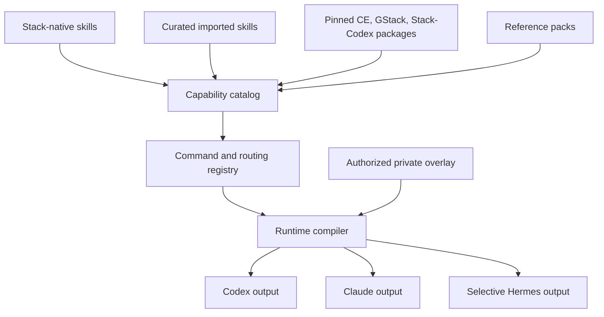
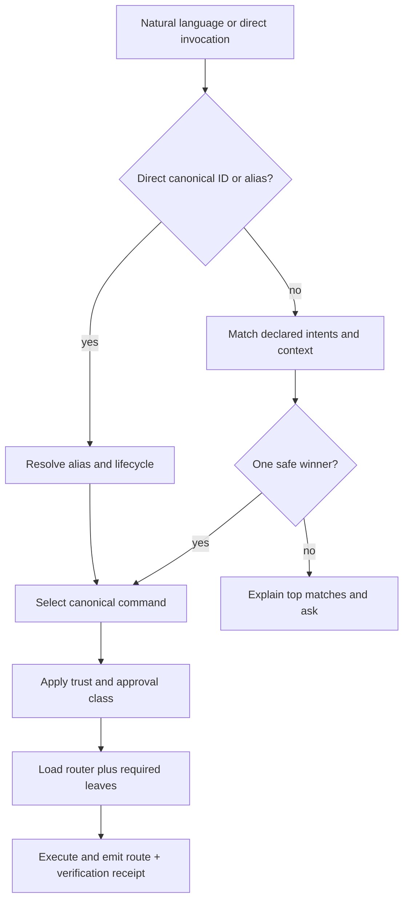
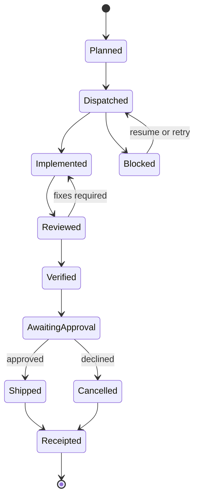
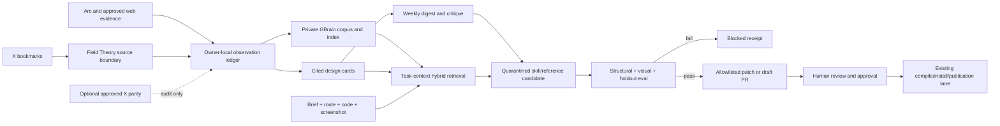
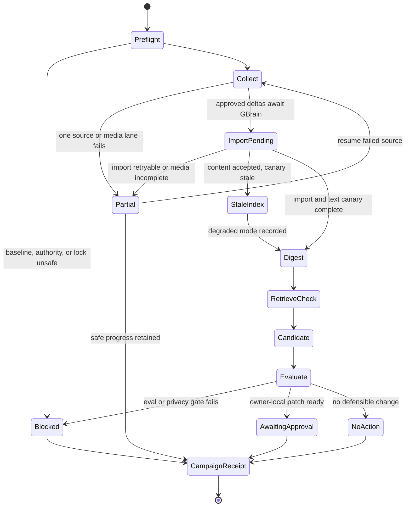
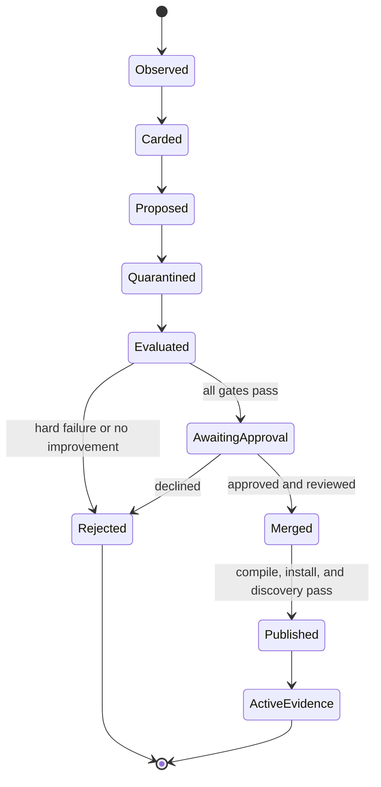
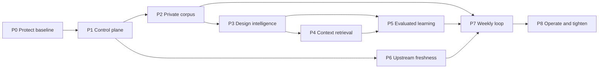

# Stack Skill and Command Architecture - Plan

## Goal Capsule

**Outcome:** Stack becomes Maroun's complete, versioned, self-improving working environment for Claude Code and Codex. It stays current, learns from the private X bookmark corpus, turns design inspiration into reusable intelligence, retrieves that intelligence during related design work, and proposes evaluated improvements to its skills and references.

**User-visible promise:** Maroun can ask naturally or invoke a command directly, understand which capability was selected, use the same logical workflow in Claude and Codex, and clone the public Stack onto a new machine. During design work, Stack can surface relevant bookmarked examples with reasons and provenance. Each week, Stack can report what changed, what it learned, what it recommends changing, and what still requires approval.

**Authority order:** Maroun's explicit request overrides Stack routing. Stack's canonical command registry overrides router prose. Field Theory and source-scoped GBrain state are authoritative for private bookmark knowledge. Package-native commands remain documented aliases. Runtime-specific exceptions must be declared rather than inferred.

**Execution boundary:** The roadmap first protects and verifies the shipped architecture. It then completes private bookmark capture, adds design intelligence and retrieval, adds evaluated skill/reference learning, joins the safe upstream-maintenance lane, and proves the weekly operating loop before scheduling it. No ingestion feature may redefine the taxonomy, command tree, package ownership, source ownership, or publication gates established earlier.

**Stop conditions:** Stop before promotion when provenance is incomplete, private content could enter public artifacts, a retrieval result cannot cite its source, an evaluated change does not beat its baseline, a protected GBrain migration is active, a paid source lacks approval, or a runtime publication gate is unmet. Stop the weekly rollout when two-run no-op proof, partial-failure recovery, and exact scheduler-state verification are absent.

---

## Product Contract

### Summary

Stack is the source of truth for how Maroun works with coding agents. It includes the skills and workflows required to explore, plan, design, build, delegate, review, verify, ship, learn, and maintain software. Design and implementation are major domains, but not the product boundary.

Stack does not replace Compound Engineering, GStack, Codex, Claude, or Hermes. It organizes them, pins their upstream packages, supplies Stack-native workflows, resolves command overlap, and publishes a consistent runtime surface.

### Problem Frame

The architecture refactor has shipped a classified estate, logical command registry, upstream package model, runtime compiler, private-overlay contract, bookmark candidate pipeline, and durable orchestration contract. At the 2026-08-23 planning snapshot, the live catalog contains 141 capabilities: 133 active and eight deprecated. That snapshot is evidence, not an execution-progress field; every implementation phase must re-verify the current catalog and source commit.

The architecture is still incomplete at the behavior seams needed by an autonomous weekly loop. Command routing is represented in metadata and generated adapters, but no production resolver test proves natural-language precedence end to end. Bookmark collection covers Field Theory SQLite, Arc sidebar state, GitHub stars or linked repositories, and Hermes links. It does not prove complete X history, Arc History, design media, source reconciliation, weekly digest generation, contextual retrieval, or candidate-to-diff materialization.

The current curation flow can collect, triage, prepare, evaluate, and record review. It stops before an approved candidate becomes a safe skill/reference patch, catalog change, or draft review artifact. The design-intelligence skill defines a stronger visual-evaluation gate, but the current external design harness is not configured, so recent candidates remain blocked. Upstream synchronization verifies declared pins but does not discover new releases and prepare a reviewable proposal.

Private knowledge and public software also need a clear boundary. All X bookmarks can belong in the private Field Theory/GBrain knowledge layer. Only software-relevant, source-faithful, evaluated derivatives may enter Stack. Raw tweets, media, personal topics, source paths, credentials, and private corpus metadata must never be copied into the public repository, generated public catalogs, or receipts.

The execution baseline is not clean. The local branch is behind `origin/main`, which contains the reviewed maintenance control plane. The worktree also contains user-owned untracked plan and design-skill work. Phase 0 must reconcile those facts without reset, stash, cleanup, or whole-tree staging before later units mutate Stack.

### Actors

- A1. **Maroun** asks naturally, invokes commands directly, approves external side effects, and expects the same conceptual Stack across personal and work machines.
- A2. **Claude Code or Codex runtime agent** resolves intent through the compiled command registry, loads only the required skills and references, and records which route and verification gate it chose.
- A3. **Stack maintainer agent** inventories and classifies capabilities, updates upstream pins, generates runtime outputs, and cannot silently create new top-level routes.
- A4. **Upstream package maintainer** owns Compound Engineering, GStack, Matt, David, Emil, Impeccable, or another imported implementation; Stack owns pins, adapters, aliases, selection, and compatibility evidence.
- A5. **Hermes** provides intake and selected design/build consumers but is not required to expose every interactive Claude/Codex command.
- A6. **Field Theory and source-scoped GBrain** own the private bookmark corpus, source boundaries, retrieval index, and source-faithful evidence identifiers.
- A7. **Weekly intelligence coordinator** composes deterministic collectors, model-assisted analysis, retrieval checks, candidate evaluation, and receipt generation without owning merge or publication authority.
- A8. **Design agent** supplies project, route, component, code, screenshot, viewport, and brief context and receives cited inspiration, critique, and applicable design patterns.

### Requirements

#### Skill architecture

- R1. Stack must represent the complete Claude Code/Codex software-working environment: exploration, product, planning, design, engineering, delegation and orchestration, review, QA, shipping, learning, and Stack maintenance.
- R2. The estate inventory must reconcile every item discovered from the allowlisted roots in `registry/inventory-sources.json`: Stack skills and packages, declared imported providers, Compound Engineering/GStack/Stack-Codex exports, configured Claude/Codex runtime injections, compatibility aliases, reference packs, and private-overlay declarations. Every exclusion requires a reviewed reason; Phase 1 cannot complete until the reconciliation artifact accounts for every discovered item.
- R3. Every inventoried item must receive a reviewed disposition: canonical command, supporting leaf, internal dependency, imported package member, reference-only material, compatibility alias, external native owner, deprecated duplicate, or archive.
- R4. Stack must define canonical capability families, visibility tiers, artifact roles, and a physical source layout before moving or activating the estate.
- R5. Known decisions remain binding: nine out-of-scope capabilities stay with their native Codex, Hermes, Zettelkasten, or Zouzou owners; four duplicate implementations remain merged behind canonical aliases.

#### Command and routing architecture

- R6. Stack must publish one runtime-neutral command tree with stable logical command IDs, family, subcommand, inputs, outputs, delegated capabilities, trust class, and verification contract.
- R7. Natural-language routing must resolve through machine-readable intent metadata with deterministic precedence, explain the chosen route, and ask rather than execute when competing routes remain materially ambiguous.
- R8. Direct upstream and legacy invocations must remain available through explicit aliases with collision detection, canonical-target warnings, and bounded deprecation policy.
- R9. The root router must remain thin: it selects a canonical workflow and delegates to composable leaf skills. It must not duplicate the full instructions of Compound Engineering, GStack, or domain skills.
- R10. Composite workflows must use one shared lifecycle for plan, delegation, checkpoint, review, QA, ship approval, completion, cancellation, partial failure, and recovery.

#### Upstream packages and runtime parity

- R11. Compound Engineering, GStack, and Stack-Codex must be first-class pinned packages in Stack, with package manifests, version or commit pins, licenses, exported commands, compatibility checks, and last-known-good rollback posture.
- R12. Matt, David, Emil, Impeccable, Studio, UI, and other imported collections must retain provider provenance and namespace without flooding the primary command surface. Every imported collection retained in the active runtime must declare an allowlisted acquisition source and immutable pin or integrity digest; reference-only collections remain outside the compiled runtime.
- R13. Every primary Claude/Codex command must expose equivalent logical behavior, context, artifacts, approval requirements, and aliases. A host-specific implementation may use a tested user-visible fallback, but an unavailable exception can satisfy parity only for explicitly extended or non-primary capabilities and requires an approved exception record naming the missing capability, fallback, owner, and expiry.
- R14. A clean clone must provide one idempotent bootstrap and doctor path that installs or verifies required packages and active imported collections from their declared immutable sources, compiles active commands, installs runtime outputs, and proves route discovery.
- R15. Hermes may consume selected compiled design/build and orchestration capabilities and own intake/scheduling, but full interactive command parity is required only for Claude and Codex.

#### Trust, workspace, and proprietary knowledge

- R16. Commands must declare an effect vector for source read, owner-local write, project write, external write, costly use, and irreversible action; explicit approval remains required for credential access, push/merge, production deployment, scheduler enablement, paid services, and destructive actions.
- R17. Parallel-agent and long-running workflows must use a durable workflow run identifier with child ownership, model role, worktree or artifact scope, checkpoints, gate state, and terminal receipt.
- R18. Plans, goals, handoffs, review packets, QA evidence, branches, worktrees, and receipts remain in the active project or owner-local state; Stack defines their contracts but does not create a second central workspace.
- R19. Proprietary reference packs must remain in authorized private overlays and never enter the public Stack repository, generated public manifests, logs, or receipts.

#### Maintenance after architecture

- R20. New skill authoring or import must declare family placement, command visibility, overlap disposition, provenance/license, validation target, route registration, and runtime support before promotion.
- R21. Bookmark and repository ingestion must run only after Phase 1 architecture is published; it may propose a leaf, reference update, route change, package update, or no action, but cannot invent a competing taxonomy.
- R22. Continuous maintenance must detect upstream drift, command collisions, aliases past their deprecation window, broken runtime parity, overlap, and obsolete capabilities without auto-deleting or auto-publishing.

#### Private bookmark knowledge and provenance

- R23. Every X bookmark available through the approved source boundary must enter the private Field Theory/GBrain corpus or receive a receipted exclusion or source-failure disposition.
- R24. A completed source run must prove cursor exhaustion, source count reconciliation, folder coverage when available, media/link capture status, deduplication lineage, and a subsequent zero-delta check before it may claim completeness.
- R25. Every private observation and derived artifact must carry stable evidence identity, original and canonical source identity, capture and revision times, content/media/link digests, adapter version, derivation lineage, and completeness state.
- R26. Raw bookmark text, media, personal-topic content, private paths, and restricted metadata must remain owner-local; public Stack changes may contain only reviewed software-relevant derivatives and opaque evidence references.
- R27. The approved default X source is Field Theory; direct X API access is an optional parity or gap-audit source that requires separate OAuth and provider-spend approval.

#### Design intelligence and contextual retrieval

- R28. Each new design-relevant observation must produce a structured design card that separates visible facts, critique, reusable principles, suitable contexts, failure modes, accessibility or motion concerns, implementation cues, and evidence citations.
- R29. Each successful weekly run must produce a source manifest, delta digest, clustered design themes, contradictions or uncertainty, reusable patterns, retrieval updates, and candidate changes or an explicit no-action result.
- R30. A design-time retrieval request must accept project, repository, route, component, viewport, device, brief, code, markup, and screenshot context when available and return ranked evidence with similarity reasons and freshness.
- R31. Retrieval must combine exact metadata or lexical filters with GBrain text/image similarity when that approved index is available; a degraded result must name the missing modality or stale index.
- R32. A design critique must distinguish source observation from interpretation and recommendation, cite every surfaced inspiration item, and avoid copying a source's visual treatment without explaining why it applies.

#### Evaluated learning and promotion

- R33. “Training Stack” means proposing source-backed changes to existing skill or reference files, plus the smallest necessary registry metadata; it never means autonomous model-weight fine-tuning or unreviewed prompt self-modification.
- R34. Each proposed skill/reference change must state the evidence set, target capability, expected behavioral change, overlap result, license posture, and rollback pointer.
- R35. A design-learning candidate must beat its pinned baseline on at least four fixed fixtures, introduce no hard failure, pass protected holdout fixtures, and preserve structural, behavioral, visual, accessibility, privacy, and citation gates before approval.
- R36. An approved candidate must materialize as an owner-local allowlisted patch in an isolated worktree; creation or update of one lineage-bound draft PR requires a separately approved review policy, and neither path may merge, publish, or install itself.

#### Weekly freshness and operations

- R37. Upstream discovery must compare canonical immutable releases or commits against declared pins and create a review packet or no-action receipt; it must not replace pins or runtime outputs during discovery.
- R38. A weekly campaign must link bookmark, design-intelligence, candidate, upstream-maintenance, and verification child receipts under one campaign identity while preserving separate locks and failure states.
- R39. Every stage must be idempotent, checkpointed, resumable, dry-run non-mutating, and explicit about `no_action`, `prepared`, `awaiting_approval`, `blocked`, `partial`, or `failed` outcomes.
- R40. Historical backfill must run as a bounded, resumable project before recurring delta mode; the scheduled loop must never silently restart full history.
- R41. Claude and Codex must expose equivalent manual collection, digest, retrieval, evaluation, and review-packet actions through existing logical command families and executed resolver tests.
- R42. Initial source synchronization, historical backfill, source-contract expansion, scheduler enablement, paid-provider use, draft-PR authority, merge, runtime publication, GBrain reindex or backend change, and destructive cleanup remain human-approved actions; approval of a pinned source contract may authorize later idempotent private-corpus deltas within that exact contract.
- R43. After enablement, every eight-day window must contain a terminal weekly campaign receipt or a visible alert that names the blocking stage, last successful run, freshness age, and safe restart action.
- R44. Unapproved generated cards, critiques, candidates, and eval outputs must remain quarantined and cannot become source evidence, retrieval truth, or future training input.

### Acceptance Examples

- AE1. “Help me plan this feature” resolves to logical command `stack.plan.technical`, invokes the Compound Engineering planning capability, records why it matched, and produces the same plan contract in Claude and Codex.
- AE2. “Run this through parallel goals” resolves to `stack.orchestrate.parallel`, invokes the Stack-Codex `orchestrate-parallel-goals` capability where supported, and uses a tested equivalent fallback elsewhere; an unavailable state cannot satisfy this primary-command example.
- AE3. Direct invocation of `ce-plan` or its Claude syntax remains valid as an alias to the canonical plan command without duplicating the underlying skill.
- AE4. “Review this” with both code and design artifacts present surfaces the competing `stack.review.code` and `stack.design.critique` routes rather than silently choosing from incidental skill order.
- AE5. `/mega` remains a compatibility alias for `stack.run.full`; `departments` becomes an alias for the product-and-design planning segment instead of maintaining a second workflow state machine.
- AE6. A missing or drifted GStack package leaves the last known-good compiled runtime active, emits an actionable package-health result, and does not silently route to a different implementation.
- AE7. A fresh work-machine clone installs the declared Claude/Codex surfaces, passes doctor checks, and resolves representative explore, plan, design, build, orchestrate, review, QA, and ship commands.
- AE8. A new bookmarked design technique is compared against the canonical design family and existing leaves before it may become a reference update, skill update, package candidate, or no action.
- AE9. A private company reference pack is available only to its authorized work runtime while the public catalog reveals no title, path, URL, or excerpt.
- AE10. A parallel implementation run with one failed child remains resumable, keeps successful child artifacts, blocks ship state, and records the failed child and required recovery.
- AE11. A historical X backfill reaches the terminal cursor, reconciles source and folder counts, records unavailable or deleted items, then runs a zero-delta pass without restarting from page one. Covers R23-R25 and R40.
- AE12. A newly bookmarked design thread and its images appear in the next delta manifest, become cited design cards, and are available to retrieval without copying the raw thread into Stack. Covers R23-R32.
- AE13. A source adapter fails after other sources complete. The campaign ends `partial`, retains successful child receipts, does not claim corpus completeness, and resumes from the failed adapter checkpoint. Covers R24, R38-R39, and R43.
- AE14. While designing a mobile media composer, the agent receives three to seven relevant cards ranked from the current route, screenshot, viewport, and brief. Each result explains the similarity and links to an opaque evidence ID. Covers R30-R32.
- AE15. A bookmarked personal or non-software topic remains searchable in the private corpus but generates no Stack candidate and leaks no title, excerpt, media, or path into public artifacts. Covers R23 and R26.
- AE16. A proposed reference change improves structural checks but regresses one protected visual or accessibility fixture. The candidate remains blocked and the active runtime is unchanged. Covers R35-R36.
- AE17. A candidate passes all evaluation gates. The loop emits an allowlisted patch or one lineage-bound draft PR and stops at `awaiting_approval`; merge and runtime publication remain separate. Covers R34-R36 and R42.
- AE18. A newer upstream release is detected. The run records the immutable ref, release notes, provider diff, compatibility evidence, and last-known-good pointer without changing the current pin. Covers R37.
- AE19. Two weekly campaigns receive identical source and policy inputs. The second run writes only its owner-local terminal receipt and creates no tracked diff, branch, PR, index churn, or runtime change. Covers R38-R39.
- AE20. Two schedulers race for the same child stage. One acquires the child lease; the other records a duplicate-run no-action outcome without mutating source, project, or runtime state. Covers R17 and R38-R39.
- AE21. GBrain image retrieval is unavailable during a design request. Stack returns clearly labeled lexical or metadata matches, names the missing modality and index age, and does not start a reindex or paid fallback. Covers R31 and R42.
- AE22. Direct X API parity is disabled. Field Theory collection still runs, and the completeness report labels API parity `not approved` rather than presenting it as a failure or silently incurring spend. Covers R24 and R27.
- AE23. The weekly loop passes manual runs but the final scheduler identity or persisted cadence cannot be verified. Rollout remains blocked and no claim of weekly operation is made. Covers R42-R43.

### Flows

- F1. **One-time source reconciliation:** protect the worktree, inventory Field Theory/GBrain state, run bounded X history backfill, reconcile counts and duplicates, perform a zero-delta pass, and freeze the first completeness baseline. Covers R23-R27 and R40.
- F2. **Weekly private intake:** acquire a source-stage lease, collect deltas read-only, normalize provenance, update the private corpus through its approved owner, and emit a manifest or partial-failure receipt. Covers R23-R27 and R38-R39.
- F3. **Weekly design digestion:** select new software/design evidence, generate design cards, cluster themes, critique patterns, record uncertainty, and emit the weekly digest. Covers R28-R29 and R32.
- F4. **Design-time retrieval:** build task context, query exact filters and approved GBrain modalities, rerank results, explain similarity, and return cited inspiration to the active design workflow. Covers R30-R32 and R41.
- F5. **Evaluated learning:** map digest insights to existing capabilities, propose the smallest skill/reference change, materialize it in isolation, run baseline and candidate fixtures, and stop at review. Covers R20-R21 and R33-R36.
- F6. **Weekly upstream freshness:** discover canonical upstream changes, prepare an allowlisted maintenance proposal or no-action receipt, and stop before pin replacement or publication. Covers R22 and R37-R39.
- F7. **Campaign closeout:** link child receipts, classify partial or blocked stages, publish freshness and next-action status, and archive only terminal no-action or prepared work under the owning automation policy. Covers R38-R43.

### Success Criteria

- The private corpus has a receipted disposition for 100% of observations exposed by every approved X source, with no cursor cycle or unexplained count, folder, media, or deduplication gap.
- 100% of surfaced inspiration and proposed Stack changes trace to evidence IDs and derivation records; public-leak tests find zero raw private fields.
- A fixed retrieval benchmark reaches `Recall@5 >= 0.80` and `nDCG@5 >= 0.75`, stays at or above 95% of the fresh baseline, and ranks every valid exact/source-scope canary at five or better; citation precision and source-scope isolation are 100%.
- Every promoted design-learning change improves at least four fixed fixtures, passes every protected holdout, and has zero hard failures.
- An unchanged campaign produces zero tracked churn, zero duplicate PRs, and one terminal no-action receipt.
- A source or stage failure preserves completed work, resumes from a checkpoint, and never upgrades `partial` or `blocked` to `complete`.
- Once scheduling is approved, each eight-day window has a terminal receipt or an actionable freshness alert.

### Scope Boundaries

#### In Scope

- A complete estate and command inventory covering local, nested, plugin, imported, and runtime-provided capabilities.
- Canonical capability families, source layout, visibility tiers, and keep/merge/package/external/deprecate decisions.
- One logical command tree with subcommands, direct aliases, intent routing, trust classes, and runtime mappings.
- First-class Compound Engineering, GStack, and Stack-Codex package integration.
- Stack-native product, design, engineering, orchestration, review, QA, shipping, learning, and maintenance capabilities.
- Claude/Codex action and context parity.
- Shared workflow-run, delegation, checkpoint, review, QA, and ship contracts.
- Clean-clone bootstrap, doctor, compilation, installation, discovery, and rollback.
- Private overlays for proprietary reference knowledge.
- Complete, source-scoped X bookmark intake into the private Field Theory/GBrain corpus.
- Source reconciliation, media-aware provenance, design cards, weekly digests, and contextual inspiration retrieval.
- Evaluated proposals for existing Stack skills, references, packages, and routes.
- Canonical upstream discovery and safe maintenance proposals.
- Manual burn-in, scheduler installation, terminal receipts, freshness alerts, and recovery runbooks.

#### Outside This Product's Identity

- Reimplementing Compound Engineering, GStack, or another healthy upstream package inside Stack.
- General finance, household, shopping, personal-file, or knowledge-maintenance workflows that do not serve software work.
- A replacement vector database, media store, or memory system inside Stack.
- Publishing the private Field Theory/GBrain corpus or unrelated personal bookmark knowledge into Stack.
- Automatic execution of instructions found in bookmarks or upstream content.
- Model-weight fine-tuning, autonomous prompt self-modification, or automatic skill publication.
- Browser scraping based on undocumented X GraphQL as a completeness authority.
- Credential entry, OAuth consent, CAPTCHA, biometric prompts, or other human-only platform authorization.

#### Deferred to Follow-Up Work

- A graphical catalog browser; Phase 1 ships a generated command/capability index and queryable CLI or documentation surface.
- Usage telemetry that requires a new account or privacy-sensitive tracking.
- Direct X API parity until OAuth scopes and provider spend receive explicit approval.
- GBrain multimodal backend changes or reindexing until the protected local-embedding migration has a verified completion audit and receives separate approval.
- Automatic merge, runtime publication, source mutation, or cleanup after a successful weekly run.

### Dependencies

- The current Field Theory source boundary and GBrain source-scoped retrieval contract must remain available and queryable.
- The protected GBrain embedding migration must complete with an owner handoff before this roadmap may start a new import writer, change index configuration, or run a multimodal reindex; read-only source-scoped canaries remain allowed.
- `origin/main` maintenance controls must be reconciled into the execution branch without overwriting user-owned untracked work.
- The companion `docs/plans/2026-08-17-001-fix-stack-maintenance-automation-plan.md` owns detailed maintenance repair, PR convergence, scheduler migration, and cleanup behavior. This master plan consumes its verified control plane.
- A design-evaluation fixture root must be present before a candidate can leave `blocked-eval`; structural evaluation alone is insufficient.

---

## Planning Contract

### Key Technical Decisions

- KTD1. **Organize by family, role, and visibility rather than by source alone.** Each capability receives a functional family, an artifact role, and a visibility tier. Provider provenance remains independent, so an imported Matt engineering leaf can live in the engineering family without losing its upstream identity.
- KTD2. **Use runtime-neutral logical command IDs.** IDs such as `stack.plan.technical` and `stack.orchestrate.parallel` are authoritative. Claude slash syntax, Codex skill names, natural-language intents, and legacy names are runtime mappings and aliases.
- KTD3. **Keep one thin root router and one composite-run router.** `agent-operating-stack` becomes the canonical `stack` router. `mega-workflow` becomes `stack.run`. `departments` and legacy `/mega:*` forms become aliases or subcommands instead of separate workflow implementations.
- KTD4. **Treat leaf skills as composable primitives and routers as policy.** Planning, implementation, browser testing, worktree creation, agent dispatch, review, and deployment remain independently callable. Composite workflows sequence them but do not hide their artifacts, approval gates, or failure state.
- KTD5. **Model healthy external systems as packages, not copied pseudo-native skills.** Compound Engineering, GStack, and Stack-Codex receive pinned package manifests and Stack-owned route adapters. The stale partial `plugins/compound-engineering/` snapshot is removed only after package parity and aliases are verified.
- KTD6. **Separate primary, extended, internal, and compatibility visibility.** Primary commands define the small command tree. Extended leaves remain directly discoverable. Internal helpers load only as dependencies. Compatibility aliases preserve muscle memory without competing for routing.
- KTD7. **Batch-classify and batch-validate by family.** The existing approved estate is not re-tested one skill at a time. Structural checks cover every entry; representative route, artifact, and runtime tests cover each family and trust class; high-risk external actions receive targeted evidence.
- KTD8. **Preserve canonical names across physical moves.** Source paths may move into family/provider directories, while logical IDs, provenance identities, and compatibility aliases remain stable through the generated registry.
- KTD9. **Fail closed to last-known-good upstream and runtime outputs.** Missing packages, changed pins, alias collisions, failed compilation, or failed discovery do not partially replace the active Stack.
- KTD10. **Claude and Codex are primary interactive runtimes; Hermes is selective.** Every primary command has Claude/Codex parity. Hermes receives only the compiled capabilities required for intake, agent operations, or named design/build workflows.
- KTD11. **Keep working artifacts with the work.** Plans and code artifacts stay in the target project; runtime receipts and private overlays stay owner-local. Stack defines schemas and routing, not a competing project-management store.
- KTD12. **Apply trust classes and effect vectors at the command boundary.** Read-only and approved reversible owner-local workflows can run autonomously. Source, owner-local, project, external, costly, and irreversible effects remain separately visible. External publication, credentials, scheduling, production state, paid services, and destructive changes retain explicit approval and rollback requirements.
- KTD13. **Architecture precedes ingestion.** Phase 2 consumes the Phase 1 family, command, package, and overlap contracts. It cannot redefine them during candidate generation.
- KTD14. **Separate the private knowledge plane from the public capability plane.** Field Theory/GBrain owns raw bookmarks and searchable private knowledge. Stack owns schemas, adapters, derived software guidance, evals, and public capability changes. This implements R23 and R26 without creating a second knowledge store.
- KTD15. **Use Field Theory as the default X boundary and direct X API only as optional parity.** The weekly path must work without a paid X dependency. An approved API lane may audit counts, folders, cursors, or missing media but cannot silently replace the canonical source. This implements R24 and R27.
- KTD16. **Use content-addressed, derivation-aware provenance.** Normalize observations and derived artifacts with SHA-256 digests and W3C PROV-inspired entity, activity, agent, `wasDerivedFrom`, and `wasGeneratedBy` relationships. Keep stable source-native IDs alongside hashes because source revision and content identity differ. This implements R25.
- KTD17. **Make the design card the durable unit of design knowledge.** The card separates facts, interpretation, reusable guidance, constraints, implementation cues, and citations. Digests, retrieval, and candidates consume cards instead of raw bookmark prose. This implements R28-R29 and R32.
- KTD18. **Use GBrain as the retrieval substrate.** Stack supplies task context, source scope, hybrid-query policy, reranking, and response format. It does not add LanceDB, sqlite-vec, FAISS, or a second media index. This implements R30-R31.
- KTD19. **Retrieve from the active design task, not a generic inspiration prompt.** The query contract accepts structured project and UI context and returns three to seven ranked exemplars with similarity explanations, evidence IDs, model/index versions, and freshness. This implements R30-R32.
- KTD20. **Keep structural capability eval and visual design eval separate.** A candidate must pass both when it changes design behavior. Visual proof uses pinned rendered fixtures, deterministic screenshots, accessibility checks, and protected holdouts. A missing visual harness is a block, not a pass. This implements R35.
- KTD21. **Train through evaluated patches, not weights.** The learning loop may change existing `SKILL.md`, reference, registry, or package metadata only through a cited candidate diff. Model weights and unattended prompt self-rewrites are outside the system. This implements R33-R36.
- KTD22. **Stop the weekly loop at a review artifact.** The default terminal success is `no_action`, `prepared`, or `awaiting_approval`. Merge, runtime publication, source mutation, and cleanup stay in their existing approval-bound lanes. This implements R36 and R42.
- KTD23. **Separate upstream discovery from upstream verification and publication.** Discovery compares canonical immutable refs and prepares proposals. Existing package compatibility and runtime publication paths verify and activate approved changes. This implements R37.
- KTD24. **Use a campaign receipt that links independently safe child runs.** Bookmark, design, candidate, and maintenance stages keep their own lease and restart state. The parent campaign records input/output digests, model/config versions, attempts, child outcomes, and freshness without sharing one mutable global lock. This implements R38-R39.
- KTD25. **Add one extended intelligence route instead of a weekly mega-command.** Logical command `stack.design.intelligence` owns `collect`, `digest`, `retrieve`, `critique`, and `propose` subcommands and delegates to the existing design-intelligence leaf. It remains extended under `stack.design`, while upstream work remains under `stack.maintain`. The owner-local coordinator composes both families and must pass executed resolver parity tests. This implements R41.
- KTD26. **Separate historical backfill, manual burn-in, and recurring delta mode.** Backfill has bounded checkpoints and an explicit completion baseline. Two identical-input manual campaigns must prove the second run is a true no-op before scheduler enablement. This implements R24 and R40-R43.
- KTD27. **Make degradation visible and non-escalating.** Missing sources, stale indexes, unavailable image retrieval, evaluation outages, and partial child failures reduce the claimed result and preserve restart state. They never trigger an unapproved paid provider, reindex, alternate source, or publication path. This implements R24, R31, R39, and R42-R43.
- KTD28. **Prove routing with an executable resolver before automation relies on it.** Metadata validation and generated instruction adapters are not enough. A deterministic resolver and Claude/Codex characterization fixtures must demonstrate selection, ambiguity, aliases, trust classes, and evidence context. This implements R7 and R41.
- KTD29. **Treat the reviewed maintenance control plane as a subordinate lane.** `config/stack-maintenance.json`, `registry/maintenance-sources.json`, `scripts/stack-maintenance.py`, and its tests own upstream proposal safety after the execution branch includes them. This plan adds discovery and campaign integration, not a competing maintenance runner. This implements R22 and R37-R39.
- KTD30. **Quarantine the learner from its own unapproved outputs.** Only approved, published source or capability revisions may enter later retrieval and candidate-generation inputs. Development fixtures, locked holdouts, and rotating owner-local canaries have separate digests and never absorb candidate output. This implements R35 and R44.
- KTD31. **Separate the Monday maintenance writer from the Saturday intelligence coordinator.** The existing maintenance automation owns upstream proposal mutation. The intelligence campaign reads its latest receipt, runs on Saturday at 09:00 local time after proof, and alerts on stale maintenance state without launching a competing maintenance writer. This implements R38-R39 and R42-R43.
- KTD32. **Use Codex automation as the campaign scheduler and Hermes as an optional intake adapter.** The Saturday Codex task owns design-intelligence coordination. Existing Hermes jobs must be inventoried before rollout and may remain only as non-overlapping intake children under the approved source contract; a second curation coordinator is blocked. This implements R38-R43.
- KTD33. **Namespace companion-plan references in this master roadmap.** `MA-R*`, `MA-KTD*`, `MA-AE*`, and `MA-U*` refer to IDs inside `docs/plans/2026-08-17-001-fix-stack-maintenance-automation-plan.md`. Unprefixed IDs always refer to this plan. This prevents cross-plan traceability collisions.
- KTD34. **Treat the Stack observation ledger as an owner-local outbox and receipt cache.** The private `x-bookmarks` GBrain source is the searchable knowledge authority. The ledger may retain raw observations until an explicit retention policy approves pruning, but it cannot become a public or competing canonical corpus. This implements R23-R26 and R42.
- KTD35. **Keep non-X sources as optional child lanes.** Arc History, curated web, GitHub, and Hermes inputs require separate configured adapters and trust checks. GitHub access is opt-in because it uses an existing credential store. Failure or absence of these lanes cannot weaken X completeness claims or silently expand the approved campaign. This implements R16, R23-R27, and R38-R39.

### Target Source Organization

```text
skills/
  core/                    # root router, composite run, doctor/help
  product/                 # exploration, strategy, product shaping
  planning/                # brainstorm, specifications, technical planning
  design/                  # direction, systems, UI, motion, critique
  engineering/             # implementation, TDD, debugging, optimization
  orchestration/           # goals, parallel agents, worktrees, handoffs
  review/                  # code, architecture, security, data, simplicity
  qa/                      # browser, iOS, accessibility, health, canary
  delivery/                # commit, PR, deploy, release
  knowledge/               # research, documentation, learning, reference packs
  platform/                # runtime context and Stack maintenance
  imported/
    matt/
    david/
    impeccable/
    emil/
    ui/
    other/
packages/
  compound-engineering/
  gstack/
  stack-codex/
registry/
  families.json
  capabilities.json
  commands.json
  routing-rules.json
  upstreams.json
```

The layout separates Stack-native skills from curated imports and external packages. Canonical capability names remain stable even when source paths move.

### Canonical Command Tree

| Logical command | Primary subcommands | Canonical owners |
|---|---|---|
| `stack` | `help`, `route`, `status` | Stack root router |
| `stack.explore` | `ideate`, `strategy`, `research` | Stack ideate, GStack office-hours/strategy, research leaves |
| `stack.plan` | `brainstorm`, `product`, `technical`, `review` | Compound Engineering brainstorm/plan, CPO, GStack plan reviews |
| `stack.design` | `direction`, `system`, `ui`, `motion`, `critique` | CDO, Studio design, Emil, Impeccable, design review |
| `stack.design.intelligence` | `collect`, `digest`, `retrieve`, `critique`, `propose` | Stack design-intelligence leaf and source-scoped GBrain adapter |
| `stack.build` | `implement`, `tdd`, `debug`, `optimize` | Compound Engineering work/LFG, Matt engineering, TDD, debug/optimize |
| `stack.orchestrate` | `parallel`, `goal`, `worktree`, `handoff`, `resume` | Stack-Codex parallel goals, goal loop, CE worktree/handoff, GStack context |
| `stack.review` | `code`, `architecture`, `security`, `data`, `simplicity` | Compound Engineering review skills, Matt review, security/data reviewers |
| `stack.qa` | `browser`, `ios`, `accessibility`, `health`, `canary` | GStack QA family, browser/iOS skills, accessibility checks |
| `stack.ship` | `commit`, `pr`, `deploy`, `release` | CE commit/PR, GStack land/deploy/release |
| `stack.learn` | `retro`, `document`, `compound` | GStack retro/docs, Compound Engineering learning refresh |
| `stack.maintain` | `doctor`, `install`, `update`, `audit` | Stack bootstrap/doctor, upstream sync, catalog audit |
| `stack.run` | `full`, `plan`, `build`, `verify`, `ship` | Canonical end-to-end composite; legacy `mega` and `departments` aliases |

The primary tree is intentionally small. Package-native commands such as `ce-plan`, `ce-work`, `autoplan`, `qa`, and `orchestrate-parallel-goals` remain directly callable as aliases or extended commands.

### Current Estate Disposition

| Current estate group | Decision | Target organization |
|---|---|---|
| 132 reviewed keeps | Keep as architecture inputs; classify by family, role, visibility, and command exposure before activation | Stack-native family or imported provider subtree |
| Four reviewed duplicate merges | Keep canonical top-level behavior and compatibility aliases; retire duplicate source after the migration window | Canonical `deslop`, `rams`, `react-doctor`, and CDO taste capability |
| Nine reviewed moves | Keep external and absent from compiled Stack runtime | Existing Codex, Hermes, Zettelkasten, or Zouzou owner |
| `agent-operating-stack` | Keep and rewrite as thin canonical root router | `skills/core/stack/` |
| `mega-workflow` | Keep the full-run composition, remove duplicated command documentation | `skills/core/run/` with `stack.run.*` |
| `departments` | Merge into the `stack.run.plan` segment; preserve alias during migration | Compatibility alias plus product/design workflow references |
| `ideate` | Keep behavior under `stack.explore.ideate`; preserve direct alias | `skills/product/ideate/` |
| CPO and CDO | Keep as product and design routers; make their leaf dependencies explicit | `skills/product/cpo/`, `skills/design/cdo/` |
| `matt-*` and `david-*` | Keep as pinned imported collections; promote only selected leaves to primary routes | `skills/imported/matt/`, `skills/imported/david/` |
| Impeccable, Emil, UI, Studio, taste, and design collections | Keep as imported leaves or reference packs; remove public command duplication | Design family and provider subtrees |
| Compound Engineering | Keep entire supported package as first-class implementation/review/ship provider | `packages/compound-engineering/` plus command mappings |
| GStack | Keep entire supported package as first-class planning/QA/delivery provider | `packages/gstack/` plus command mappings |
| Stack-Codex | Move from local-only plugin ownership into Stack's first-class package model | `packages/stack-codex/` plus orchestration routes |
| Partial `plugins/compound-engineering/` snapshot | Remove after pinned package exports and compatibility tests cover every retained route | Replaced by package manifest and installer |

### High-Level Technical Design

#### Source, catalog, and runtime topology


```mermaid
flowchart TB
  N["Stack-native skills"] --> C["Capability catalog"]
  I["Curated imported skills"] --> C
  P["Pinned CE, GStack, Stack-Codex packages"] --> C
  R["Reference packs"] --> C
  C --> T["Command and routing registry"]
  T --> B["Runtime compiler"]
  O["Authorized private overlay"] --> B
  B --> CDX["Codex output"]
  B --> CLD["Claude output"]
  B --> HMS["Selective Hermes output"]
```

#### Intent and direct-command routing


```mermaid
flowchart TB
  Q["Natural language or direct invocation"] --> D{"Direct canonical ID or alias?"}
  D -->|yes| A["Resolve alias and lifecycle"]
  D -->|no| I["Match declared intents and context"]
  I --> M{"One safe winner?"}
  M -->|yes| S["Select canonical command"]
  M -->|no| U["Explain top matches and ask"]
  A --> S
  S --> G["Apply trust and approval class"]
  G --> L["Load router plus required leaves"]
  L --> X["Execute and emit route + verification receipt"]
```

#### Long-running workflow lifecycle


```mermaid
stateDiagram-v2
  [*] --> Planned
  Planned --> Dispatched
  Dispatched --> Implemented
  Dispatched --> Blocked
  Blocked --> Dispatched: resume or retry
  Implemented --> Reviewed
  Reviewed --> Implemented: fixes required
  Reviewed --> Verified
  Verified --> AwaitingApproval
  AwaitingApproval --> Shipped: approved
  AwaitingApproval --> Cancelled: declined
  Shipped --> Receipted
  Cancelled --> Receipted
  Receipted --> [*]
```

#### Private knowledge, retrieval, and learning topology


```mermaid
flowchart LR
  X["X bookmarks"] --> FT["Field Theory source boundary"]
  ARC["Arc and approved web evidence"] --> OBS["Owner-local observation ledger"]
  FT --> OBS
  API["Optional approved X parity"] -. "audit only" .-> OBS
  OBS --> GB["Private GBrain corpus and index"]
  OBS --> CARD["Cited design cards"]
  CARD --> DIGEST["Weekly digest and critique"]
  GB --> RET["Task-context hybrid retrieval"]
  CARD --> RET
  CTX["Brief + route + code + screenshot"] --> RET
  DIGEST --> CAND["Quarantined skill/reference candidate"]
  RET --> CAND
  CAND --> EVAL["Structural + visual + holdout eval"]
  EVAL -->|fail| BLOCK["Blocked receipt"]
  EVAL -->|pass| PATCH["Allowlisted patch or draft PR"]
  PATCH --> HUMAN["Human review and approval"]
  HUMAN --> PUB["Existing compile/install/publication lane"]
```

Raw evidence stays on the private side of the boundary. Public Stack artifacts begin at reviewed, software-relevant derivatives and opaque evidence IDs.

#### Weekly campaign and child-run lifecycle


```mermaid
stateDiagram-v2
  [*] --> Preflight
  Preflight --> Blocked: baseline, authority, or lock unsafe
  Preflight --> Collect
  Collect --> Partial: one source or media lane fails
  Collect --> ImportPending: approved deltas await GBrain
  Partial --> Collect: resume failed source
  ImportPending --> Partial: import retryable or media incomplete
  ImportPending --> StaleIndex: content accepted, canary stale
  ImportPending --> Digest: import and text canary complete
  StaleIndex --> Digest: degraded mode recorded
  Digest --> RetrieveCheck
  RetrieveCheck --> Candidate
  Candidate --> Evaluate
  Evaluate --> Blocked: eval or privacy gate fails
  Evaluate --> AwaitingApproval: owner-local patch ready
  Evaluate --> NoAction: no defensible change
  AwaitingApproval --> CampaignReceipt
  NoAction --> CampaignReceipt
  Blocked --> CampaignReceipt
  Partial --> CampaignReceipt: safe progress retained
  CampaignReceipt --> [*]
```

The upstream-maintenance child runs beside the intelligence path. The campaign links both terminal receipts but does not share their leases or mutation authority.

#### Promotion state machine


```mermaid
stateDiagram-v2
  [*] --> Observed
  Observed --> Carded
  Carded --> Proposed
  Proposed --> Quarantined
  Quarantined --> Evaluated
  Evaluated --> Rejected: hard failure or no improvement
  Evaluated --> AwaitingApproval: all gates pass
  AwaitingApproval --> Rejected: declined
  AwaitingApproval --> Merged: approved and reviewed
  Merged --> Published: compile, install, and discovery pass
  Published --> ActiveEvidence
  Rejected --> [*]
  ActiveEvidence --> [*]
```

Only `Published` revisions may become future training evidence. `Proposed`, `Quarantined`, and `Rejected` artifacts remain excluded by R44.

---

## Implementation Units

### Unit Index

| Unit | Title | Primary files | Depends on |
|---|---|---|---|
| U10 | Define skill architecture and family taxonomy | `docs/skill-architecture.md`, `registry/families.json` | None |
| U11 | Build canonical command and routing registry | `registry/commands.schema.json`, `registry/routing-rules.json` | U10 |
| U12 | Model and pin upstream packages | `registry/upstreams.json`, `packages/*/package.json` | U10, U11 |
| U1 | Make the capability catalog architecture-aware | `registry/capabilities.schema.json`, `skills/**/capability.json` | U10, U11, U12 |
| U2 | Audit and classify the full callable estate | `scripts/audit-capabilities.py`, audit artifacts | U1 |
| U3 | Apply the physical and router consolidation | `registry/migrations/*`, `skills/**`, router skills | U2 |
| U13 | Define durable orchestration runs and shared artifacts | workflow-run schema and orchestration skills | U11, U12 |
| U9 | Join authorized private knowledge | private-overlay contract | U1, U12 |
| U4 | Compile, bootstrap, and prove runtime parity | compiler, installer, bootstrap, doctor | U1, U3, U9, U11, U12, U13 |
| U5 | Add architecture-aware intake and triage | collection and triage scripts | Phase 1 complete |
| U6 | Evaluate and promote candidates | evaluation and activation scripts | U5, U4 |
| U7 | Connect Hermes intake and scheduling | Hermes adapter and Stack wrapper | U5, U6 |
| U8 | Document and operate continuous governance | README, runbooks, reassessment | U1-U7, U9-U13 |
| U14 | Reconcile the live baseline and prove routing | resolver, characterization fixtures, catalog reconciliation | U4, U11 |
| U15 | Complete private X capture and historical reconciliation | source schema, completeness ledger, backfill runner | U5, U9, U14 |
| U16 | Build design cards, critique, and weekly digest | design-intelligence schemas, packet builder, fixtures | U15 |
| U17 | Add task-context retrieval through GBrain | retrieval contract, adapter, benchmark | U9, U14, U16 |
| U18 | Materialize and evaluate skill/reference learning | candidate materializer, visual eval, holdouts | U6, U16, U17 |
| U19 | Add upstream discovery to the maintenance lane | maintenance policy, discovery proposal, compatibility tests | U12, U14 |
| U20 | Prove and operate the weekly campaign | campaign coordinator, receipt schema, scheduler runbook | U7-U8, U15-U19 |

### U10. Define Skill Architecture and Family Taxonomy

**Goal:** Establish the product architecture that every existing and future capability must fit.

**Requirements:** R1-R5, R12

**Dependencies:** None

**Files:**

- `docs/skill-architecture.md`
- `registry/families.schema.json`
- `registry/families.json`
- `templates/estate-decision-matrix.json`
- `tests/test_skill_architecture.py`

**Approach:** Define the canonical families, artifact roles, visibility tiers, provider ownership, and target source layout in this plan. Encode them in a small family registry. Require every capability to name one primary family, optional supporting families, one role, and one visibility tier. Treat physical paths as implementation details behind stable logical IDs.

**Patterns to follow:** Capability-local metadata remains authoritative; generated registries remain deterministic; current provenance identities and compatibility aliases remain stable.

**Test scenarios:**

1. Every declared family has a unique stable ID, description, allowed roles, and default trust posture.
2. A capability with no primary family or an unknown visibility tier fails validation.
3. A router may span multiple supporting families but must own one primary command family.
4. Imported provider identity remains independent from functional family.
5. The nine external moves cannot be reclassified into an active Stack family without a new reviewed migration.

**Verification:** The target architecture is sufficient to classify every current capability and package without using `unclassified`.

### U11. Build the Canonical Command and Routing Registry

**Goal:** Replace overlapping router prose with one generated command tree that both runtimes can interpret.

**Requirements:** R6-R10, R13, R16

**Dependencies:** U10

**Files:**

- `registry/commands.schema.json`
- `registry/commands.json`
- `registry/routing-rules.json`
- `scripts/build-command-registry.py`
- `skills/core/stack/SKILL.md`
- `skills/core/run/SKILL.md`
- `docs/command-tree.md`
- `tests/test_command_registry.py`
- `tests/test_intent_routing.py`

**Approach:** Store authoritative route metadata beside capabilities and generate the aggregate command tree. Define logical IDs, family/subcommand relationships, intent phrases, inputs, outputs, delegated leaves, aliases, precedence, lifecycle, trust class, and runtime mappings. Generate the root router and compact command index from this registry so documentation and routing cannot drift.

**Execution note:** Start with characterization fixtures for the current `agent-operating-stack`, `/mega`, `departments`, `/ideate`, CE, GStack, and Stack-Codex routes before consolidating them.

**Test scenarios:**

1. Representative natural-language requests select the intended explore, plan, design, build, orchestrate, review, QA, ship, learn, and maintain commands.
2. A direct canonical ID bypasses fuzzy intent matching but still applies lifecycle and trust checks.
3. A legacy alias resolves to one canonical target and emits its canonical replacement.
4. Alias-to-alias chains, duplicate aliases, and active targets with conflicting primary routes fail generation.
5. Ambiguous “review this” context surfaces competing code/design routes and performs no mutation.
6. An inactive or unavailable package target cannot win routing.
7. Generated router documentation exactly matches `registry/commands.json`.

**Verification:** Every primary and extended command has one logical ID, one owner, unique aliases, an explainable route, and a declared Claude/Codex mapping.

### U12. Model and Pin Upstream Packages

**Goal:** Make Compound Engineering, GStack, Stack-Codex, and imported providers real parts of Stack without copying or forking them invisibly.

**Requirements:** R11-R15

**Dependencies:** U10, U11

**Files:**

- `registry/upstreams.schema.json`
- `registry/upstreams.json`
- `upstreams.lock.json`
- `packages/compound-engineering/package.json`
- `packages/gstack/package.json`
- `packages/stack-codex/package.json`
- `packages/imported-skills/package.json`
- `scripts/sync-upstreams.py`
- `THIRD_PARTY_NOTICES.md`
- `tests/test_upstream_packages.py`

**Approach:** Record provider, allowlisted canonical source, full immutable commit or package integrity digest, license, exported skills/commands, runtime install mechanism, Stack-owned adapters, update policy, compatibility suite, and last-known-good version. Verify origin and integrity before extraction, adapter generation, or staging. Import source only when licensing and runtime packaging require it; otherwise install from the pinned provider and compile Stack-owned mappings. Quarantine drift or integrity mismatch rather than modifying active outputs.

**Test scenarios:**

1. A clean checkout resolves each required package to its declared pin and exports the expected command set.
2. A missing, changed, or unlicensed package fails package health without replacing the active runtime.
3. Upstream and Stack aliases that collide require an explicit canonical winner.
4. A local override is visible as a Stack-owned adapter with upstream provenance rather than masquerading as upstream source.
5. The old partial Compound snapshot cannot be removed until every retained route has package parity.
6. Third-party notices enumerate copied or adapted content without claiming a new license over upstream work.
7. A mutable tag, unexpected origin, or content digest mismatch fails before extraction and leaves last-known-good outputs active.

**Verification:** CE, GStack, Stack-Codex, Matt, David, and major design providers have current pins, license posture, exported routes, compatibility evidence, and rollback targets.

### U1. Make the Capability Catalog Architecture-Aware

**Goal:** Extend the catalog from a flat manifest list into the source of truth for family, role, command, package, and runtime semantics.

**Requirements:** R2-R4, R6, R11-R15, R19-R20

**Dependencies:** U10, U11, U12

**Files:**

- `registry/inventory-sources.json`
- `registry/capabilities.schema.json`
- `skills/**/capability.json`
- `registry/capabilities.json`
- `scripts/build-capability-registry.py`
- `registry/README.md`
- `tests/test_capability_registry.py`

**Approach:** Add family, role, visibility, command membership, package ownership, context contract, trust class, validation class, supported runtimes, and publish targets. Keep command and upstream aggregates generated from capability-local and package-local sources. Declare authoritative discovery roots and reviewed exclusions in `registry/inventory-sources.json`; generate a reconciliation artifact proving every discovered item received a disposition. Migrate manifests mechanically from the reviewed estate matrix rather than hand-editing the aggregate.

**Test scenarios:**

1. Every non-external entry has a valid family, role, visibility, provenance owner, and runtime posture.
2. A primary command leaf must belong to a canonical command and declare its input/output context.
3. Imported package members retain provider identity while participating in functional families.
4. Private-overlay metadata validates without public private paths or payloads.
5. Every item found under an authoritative inventory root appears in the reconciliation artifact as classified or explicitly excluded with a reviewed reason.
5. Direct edits to generated registries fail reproducibility checks.
6. No post-migration catalog record remains `unclassified`.

**Verification:** The generated capability, command, family, and upstream registries agree on identifiers, owners, aliases, dependencies, and target support.

### U2. Audit and Classify the Full Callable Estate

**Goal:** Produce the exact keep, merge, package, internalize, reference, external, deprecate, and archive map the earlier audit did not provide.

**Requirements:** R2-R5, R12

**Dependencies:** U1

**Files:**

- `scripts/audit-capabilities.py`
- `config/audit-policy.json`
- `templates/capability-audit.md`
- `artifacts/audits/<date>/capability-audit.json`
- `artifacts/audits/<date>/capability-audit.md`
- `tests/test_audit_capabilities.py`

**Approach:** Inventory local skills, nested entrypoints, plugin commands/agents, installed CE/GStack/Stack-Codex exports, imported collections, references, aliases, and runtime surfaces. Classify by family and visibility, then review overlap using behavior and consumers rather than lexical similarity. Batch-confirm unchanged imported leaves and structural classifications; reserve item-level judgment for canonical-route winners, external moves, archives, and unsafe commands.

**Test scenarios:**

1. The audit includes all current local manifests plus external package exports without double-counting package members as Stack-native.
2. Router and workflow entries are reported separately from leaves and internal agents.
3. Known duplicate clusters preserve the four canonical merge decisions.
4. The nine moved capabilities remain external with consumer receipts.
5. Similar names without behavioral evidence remain separate rather than auto-merged.
6. Every command collision names all owners and requires a route disposition.
7. Re-running against the same source and package pins produces stable ordered output.

**Verification:** Every inventory item has family, role, visibility, owner, command exposure, runtime posture, and reviewed disposition; no callable surface is hidden only in prose.

### U3. Apply the Physical and Router Consolidation

**Goal:** Reorganize the source estate and remove competing routers without breaking names or consumers.

**Requirements:** R3-R9, R12-R15

**Dependencies:** U2

**Files:**

- `registry/migrations/<date>-skill-architecture.json`
- `scripts/validate-capability-migration.py`
- `skills/core/**`
- `skills/product/**`
- `skills/planning/**`
- `skills/design/**`
- `skills/engineering/**`
- `skills/orchestration/**`
- `skills/review/**`
- `skills/qa/**`
- `skills/delivery/**`
- `skills/knowledge/**`
- `skills/platform/**`
- `skills/imported/**`
- `tests/test_validate_capability_migration.py`

**Approach:** Move sources by reviewed family/provider decisions while preserving logical IDs. Rewrite `agent-operating-stack` as the root router and `mega-workflow` as the sole composite-run router. Fold `departments` into `stack.run.plan`, keep CPO/CDO as product/design routers, and preserve legacy invocations as compiled aliases. Remove deprecated duplicate implementations and the partial Compound snapshot only after consumer and package parity receipts pass.

**Test scenarios:**

1. A migration dry run lists every path move, logical ID, alias, package transition, and affected consumer.
2. Old aliases continue to resolve to the same canonical behavior after source moves.
3. A missing destination, path collision, broken reference, or duplicate route fails before partial application.
4. The root router contains route policy and links, not copied leaf workflows.
5. `stack.run.plan` covers the former departments behavior without maintaining separate pipeline state.
6. A post-migration audit reports no ghost paths, stale manifest sources, or unclassified entries.

**Verification:** The physical tree matches the family/provider architecture, every canonical command remains callable, and removed routers or duplicates have working aliases or explicit retirement receipts.

### U13. Define Durable Orchestration Runs and Shared Artifacts

**Goal:** Make goals, parallel agents, checkpoints, handoffs, review, QA, and ship one observable and resumable lifecycle.

**Requirements:** R10, R16-R18

**Dependencies:** U11, U12

**Files:**

- `registry/workflow-run.schema.json`
- `docs/orchestration-contract.md`
- `skills/orchestration/parallel-goals/SKILL.md`
- `skills/orchestration/goal/SKILL.md`
- `skills/orchestration/handoff/SKILL.md`
- `tests/test_orchestration_contract.py`

**Approach:** Bring `orchestrate-parallel-goals` under the Stack package and command model. Define run, child, owner, model role, workspace/worktree, checkpoint, gate, failure, cancellation, resume, and receipt fields. Use an owner-local SQLite control store at the platform state directory for run identity, leases, child ownership, checkpoint state, and terminal receipts; key records by canonical project identity and use transactional lease expiry to prevent duplicate children and stale locks. Project plans and code artifacts remain in the active project, while Stack carries the schema, migration, and CLI adapters shared by Claude and Codex.

**Test scenarios:**

1. A parallel run records bounded children, explicit ownership, model roles, and no nested fan-out beyond policy.
2. A failed child blocks later ship state while successful child artifacts remain available.
3. A resumed run cannot duplicate a completed child or reuse a stale lock silently.
4. Review, QA, and ship remain separate gates with distinct evidence.
5. External mutation waits for the command's approval class.
6. Claude and Codex represent the same logical run states despite host-specific agent APIs.
7. Concurrent adapters cannot claim the same child lease, and an expired lease can be recovered transactionally without duplicating a completed child.

**Verification:** A plan-to-parallel-work dry run can pause, resume, review, verify, and reach an approval boundary with one traceable run identifier and complete terminal receipt.

### U4. Compile, Bootstrap, and Prove Runtime Parity

**Goal:** Make a GitHub clone install and expose the same active logical Stack in Claude and Codex.

**Requirements:** R6-R19

**Dependencies:** U1, U3, U9, U11, U12, U13

**Files:**

- `scripts/compile-runtime.py`
- `scripts/install-runtime.py`
- `scripts/bootstrap-stack.py`
- `scripts/stack-doctor.py`
- `config/runtime-targets.json`
- `docs/runtime-publication.md`
- `docs/setup-guide.md`
- `tests/test_compile_runtime.py`
- `tests/test_install_runtime.py`
- `tests/test_runtime_parity.py`
- `tests/test_fresh_clone.py`

**Approach:** Compile active capabilities, command mappings, aliases, package adapters, context contracts, and private-overlay joins into digest-addressed targets. Bootstrap verifies prerequisites and upstream pins before staging. Install switches only after all targets and discovery checks pass. Doctor reports package health, route coverage, runtime parity, stale aliases, and active source commit.

**Execution note:** Prefer fresh-clone and runtime smoke proof over unit-only confidence; publication behavior spans Git, packages, generated outputs, and two host runtimes.

**Test scenarios:**

1. A fresh public clone resolves packages, builds registries, compiles targets, and passes dry-run doctor without private material.
2. Claude and Codex resolve representative commands to the same logical IDs, inputs, outputs, trust classes, and aliases.
3. Every primary command has equivalent behavior or a tested user-visible fallback; unavailable exceptions are rejected for primary commands and remain explicit, approved, owned, and expiring for extended commands.
4. Package drift, compile failure, target verification failure, or route collision preserves all prior runtime pointers.
5. Bootstrap reruns idempotently and repairs partial staging without duplicating installed skills.
6. Natural-language and direct-command smoke requests discover the installed root router and representative family commands.
7. Publication receipts bind the same source commit, package pins, catalog digest, command digest, and prior rollback pointers.

**Verification:** A clean checkout can install and discover representative explore, plan, design, build, orchestrate, review, QA, ship, learn, and maintain routes in both primary runtimes.

### U9. Join Authorized Private Knowledge

**Goal:** Make proprietary references available to approved local or work runtimes without putting them in public Stack source.

**Requirements:** R19

**Dependencies:** U1, U12

**Files:**

- `registry/private-overlay.schema.json`
- `docs/private-overlay.md`
- `tests/test_private_overlay_contract.py`
- Owner-local private overlay and authorized-runtime manifest

**Approach:** Keep opaque public capability linkage and owner-local payloads. Bind authorization to a trusted local target identity and join private references only for named targets after permission, ownership, payload, leak, and target authorization checks. Any authorization or validation failure atomically invalidates and removes prior private compiled outputs for that target without changing public runtime pointers. Private material may enrich any family but cannot create undeclared public commands.

**Test scenarios:**

1. An authorized work runtime uses a private reference pack through an existing command.
2. An unauthorized target excludes the reference and cannot infer its title, path, URL, or excerpt.
3. Public registries, command indexes, receipts, and logs remain free of private identifying data.
4. Revoking authorization immediately makes every prior private artifact for that target unreadable without corrupting public runtime state.

**Verification:** A private fixture improves one authorized route and remains absent from all unauthorized and public artifacts.

### U5. Add Architecture-Aware Intake and Triage

**Goal:** Add new bookmark and repository evidence without recreating skill sprawl.

**Requirements:** R20-R22

**Dependencies:** Phase 1 Definition of Done

**Files:**

- `scripts/collect-bookmark-candidates.py`
- `scripts/triage-bookmark-candidates.py`
- `config/bookmark-sources.json`
- `config/bookmark-fetch-policy.json`
- `config/private-data-handling.json`
- `references/bookmark-source-adapters.md`
- `templates/bookmark-candidate-review.md`
- `tests/test_collect_bookmark_candidates.py`
- `tests/test_triage_bookmark_candidates.py`

**Approach:** Preserve the existing read-only, incremental, owner-local ledger. Enforce the fetch contract at collection time: HTTPS-only approved adapters or hosts, redirect-by-redirect validation, DNS/IP rejection for loopback, link-local, private, and reserved ranges, and bounded response size and timeout. Require every proposal to name its target family, canonical command relationship, overlap result, artifact role, provider posture, and smallest durable change. Treat package update, reference update, existing-leaf update, no action, and blocked import as preferred outcomes before new primary commands.

**Test scenarios:**

1. New Field Theory/X, Arc, GitHub, and Hermes observations normalize under one source contract.
2. A candidate overlapping a canonical command becomes evidence or an update rather than a duplicate route.
3. A relevant package update targets the upstream manifest and compatibility suite rather than copying source blindly.
4. A candidate with no family or command placement remains unpromotable.
5. Untrusted content cannot modify route metadata, files, approvals, or runtime state.
6. Unchanged reruns remain idempotent while changed pins, licenses, or content revisions re-enter triage.
7. Private URLs, paths, titles, excerpts, credentials, and restricted metadata remain owner-local.
8. Direct and redirected internal-network targets, oversized responses, and fetch timeouts fail closed without recording sensitive response content.

**Verification:** A live read-only run produces bounded candidates that all reference the Phase 1 architecture and proposes no competing taxonomy or unregistered command.

### U6. Evaluate and Promote Candidates

**Goal:** Promote the smallest defensible architecture-aware change without automatic command growth.

**Requirements:** R20-R22

**Dependencies:** U5, U4

**Files:**

- `scripts/prepare-capability-candidate.py`
- `scripts/evaluate-capability-candidate.py`
- `scripts/record-capability-review.py`
- `config/candidate-evaluation-profiles.json`
- `config/capability-activation-policy.json`
- `tests/test_prepare_capability_candidate.py`
- `tests/test_evaluate_capability_candidate.py`
- `tests/test_record_capability_review.py`

**Approach:** Evaluate immutable candidate pins in a disposable, credential-free, network-denied workspace. Require architecture placement and provenance review before evaluation. Promotion may update a reference, leaf, route, alias, package pin, or catalog state, but a new primary command requires explicit command-architecture review.

**Test scenarios:**

1. A reference insight cannot become a callable command without a procedure, placement, and evaluation target.
2. Updating an existing leaf preserves provenance and command ownership.
3. A proposed new primary command requires a collision-free route decision and human approval.
4. Failed evaluation leaves active registries and runtimes unchanged.
5. Malicious candidate filesystem, credential, network, dependency, and parent-workspace access fails closed.
6. Successful approval still requires U4 compilation, installation, discovery, and receipt.

**Verification:** Every candidate outcome is traceable through source, architecture placement, evaluation, approval, and runtime publication without bypassing the command registry.

### U7. Connect Hermes Intake and Scheduling

**Goal:** Let explicit Hermes links and approved intake scans feed the architecture-aware lifecycle without creating a second weekly coordinator.

**Requirements:** R15-R16, R20-R22, R38-R43

**Dependencies:** U5, U6

**Files:**

- Hermes `plugins/mookie-link-inbox/__init__.py`
- Hermes `plugins/mookie-link-inbox/plugin.yaml`
- Hermes `scripts/mookie_link_inbox.py`
- Hermes `tests/test_mookie_link_inbox.py`
- `scripts/run-stack-bookmark-curation.sh`
- `scripts/install-hermes-stack-curation-job.sh`

**Approach:** Preserve durable intake IDs and distinct capture, triage, proposal, evaluation, and publication receipts. Hermes submits evidence and consumes selected compiled capabilities; it does not own Stack taxonomy or design curation. Inventory the existing daily/Monday Hermes jobs and keep any approved recurring behavior intake-only. U20 owns the single Saturday design-intelligence coordinator and its separate scheduler approval.

**Test scenarios:**

1. Explicit capture returns an intake ID without claiming a Stack change.
2. Later disposition links to family, canonical command, source commit, and runtime receipt when applicable.
3. Scheduler, source, evaluation, and publication failures remain distinct.
4. Unauthorized or missing identities fail before intake writes.
5. No live recurring job appears without explicit enablement after run-now proof.
6. An enabled Hermes intake job cannot acquire the design-curation or upstream-maintenance writer lease.

**Verification:** Manual Hermes intake follows the same architecture-aware candidate lifecycle, and scheduler state remains independently verifiable.

### U8. Document and Operate Continuous Governance

**Goal:** Make the architecture, command tree, installation, and maintenance understandable without chat history.

**Requirements:** R1-R44

**Dependencies:** U1-U7, U9-U13

**Files:**

- `README.md`
- `docs/architecture.md`
- `docs/skill-architecture.md`
- `docs/command-tree.md`
- `docs/capability-lifecycle.md`
- `docs/runtime-publication.md`
- `docs/bookmark-curation.md`
- `docs/design-intelligence-loop.md`
- `docs/weekly-intelligence-operations.md`
- `templates/periodic-reassessment.md`
- `.github/workflows/test.yml`
- `tests/test_documented_commands.py`

**Approach:** Lead documentation with what is in Stack and how it routes, then explain package ownership, private knowledge boundaries, installation, design intelligence, candidate quarantine, publication, scheduling, and recovery. Generate family/command indexes from registries. Run the full test and sensitive-content suite in GitHub Actions. U20 supplies final live-scheduler evidence without making the documentation claim ahead of proof.

**Test scenarios:**

1. Every documented family, logical command, alias, package, and file reference resolves.
2. A reader can answer what is kept, imported, internal, deprecated, or external from the generated architecture index.
3. Quick start performs a fresh-clone bootstrap and doctor check without exposing private overlays.
4. Documentation does not claim runtime parity or package health beyond current receipts.
5. CI executes registry, routing, package, runtime-parity, fresh-clone, source-contract, retrieval, candidate-quarantine, maintenance, and sensitive-content checks.
6. The runbook distinguishes source capture, private import, indexing, candidate preparation, merge, runtime publication, and scheduler enablement receipts.

**Verification:** A new agent or work-machine user can understand the Stack, install it, route representative work, and trace each command to its owner and source using repository documentation alone.

### U14. Reconcile the Live Baseline and Prove Routing

**Goal:** Establish a protected, current execution baseline and replace metadata-only routing confidence with an executable resolver contract.

**Requirements:** R2-R8, R13-R14, R41

**Dependencies:** U4, U11

**Files:**

- `scripts/build-command-registry.py`
- `scripts/resolve-command.py`
- `registry/commands.json`
- `registry/routing-rules.json`
- `config/runtime-targets.json`
- `tests/test_intent_routing.py`
- `tests/test_runtime_command_adapters.py`
- `tests/fixtures/routing/**`

**Approach:** Start in an isolated branch or worktree from a verified current `origin/main`. Preserve the user-owned untracked maintenance plan and design-skill directories before any branch integration. Hold callable skills without `capability.json` outside generated runtime changes until they receive a reviewed disposition. Implement one deterministic resolver that consumes registry data and emits the logical command, match reason, ambiguity state, trust class, effect vector, and required evidence context. Register extended command `stack.design.intelligence` with its context-aware subcommands. Make generated Claude and Codex adapters call or characterize that same resolver contract.

**Test scenarios:**

1. The current catalog rebuild accounts for every allowlisted capability and reports the same active/deprecated set from a clean checkout.
2. User-owned untracked files survive baseline reconciliation byte-for-byte and never enter allowlisted staging by accident.
3. Representative natural-language requests resolve across every primary family with a recorded reason.
4. Ambiguous design-versus-code review context produces an explicit choice instead of incidental ordering.
5. Direct aliases and canonical IDs converge on the same logical route and trust class.
6. Claude and Codex fixtures receive equivalent route, context, evidence, and approval state.
7. An unknown or metadata-incomplete capability stays out of the runtime rather than inheriting a route.
8. “Show me relevant inspiration for this screen” resolves to `stack.design.intelligence retrieve` with task-context inputs in Claude and Codex.

**Verification:** `python3 -m unittest tests.test_intent_routing tests.test_runtime_command_adapters tests.test_command_registry tests.test_runtime_parity` passes from the reconciled baseline, and `scripts/stack-doctor.py --dry-run` reports the verified source commit without mutating runtimes.

### U15. Complete Private X Capture and Historical Reconciliation

**Goal:** Prove that every available X bookmark has a private, regenerable disposition before weekly delta collection begins.

**Requirements:** R23-R27, R38-R40, R42-R44

**Dependencies:** U5, U9, U14

**Files:**

- `registry/source-observation.schema.json`
- `registry/source-snapshot.schema.json`
- `registry/source-page-receipt.schema.json`
- `registry/gbrain-import-receipt.schema.json`
- `config/bookmark-sources.json`
- `config/bookmark-fetch-policy.json`
- `config/bookmark-private-ledger.json`
- `references/bookmark-source-adapters.md`
- `scripts/reconcile-bookmark-sources.py`
- `scripts/backfill-bookmark-history.py`
- `scripts/import-bookmark-deltas.py`
- `tests/test_bookmark_completeness.py`
- `tests/test_bookmark_backfill.py`
- `tests/test_bookmark_gbrain_import.py`
- `tests/fixtures/bookmark-sources/**`

**Approach:** Extend collection into a snapshot and page ledger. Allowlist exact Field Theory tables, columns, export roots, and media roots instead of scanning arbitrary SQLite tables. Record the source lane, opaque account identity, endpoint or query, requested cursor, returned cursor, page ordinal, canonical IDs, folder membership, raw-response digest, retry or rate-limit state, media resolution, adapter version, and policy/schema digest. Canonicalize JSON before SHA-256 hashing. Compare Field Theory and any separately approved X snapshot by canonical ID and folder-membership sets. Classify missing, extra, duplicate, revised, deleted, and unavailable-media observations. Default every adapter to audit/read-only. After one-time source-contract approval, hand idempotent deltas to the owning GBrain CLI under source `x-bookmarks` and record accepted, rejected, pending, and indexed canary identities. Treat the Stack ledger as an owner-local outbox and receipt cache. Route source repair through Field Theory/GBrain instead of writing around either owner.

**Test scenarios:**

1. A multi-page history terminates only when every cursor closes, with no cursor cycle or unclassified error.
2. Folder membership and post/media hydration reconcile independently.
3. Missing media records MIME type, byte count, digest, or an explicit unavailable reason.
4. Field Theory and optional X parity snapshots report set differences without treating ordering as drift.
5. A 429 or partial page produces `partial` or `unknown`, persists a safe resume cursor, and never reports parity pass.
6. An optional X adapter requests read scopes only, detects required-field or scope drift, and stops before provider use when approval is absent.
7. A dry run against a missing ledger path creates no database, directory, or source mutation.
8. A second identical backfill is zero-delta and does not restart full history.
9. An interrupted GBrain import resumes only unaccepted identities and does not duplicate accepted content.
10. A successful import is not `indexed` until a source-scoped text retrieval canary passes; missing multimodal indexing remains a separate visible state.

**Verification:** `python3 -m unittest tests.test_collect_bookmark_candidates tests.test_materialize_bookmark_candidates tests.test_bookmark_completeness tests.test_bookmark_backfill tests.test_bookmark_gbrain_import` passes. A manually approved backfill yields a complete or truthfully partial source snapshot, an idempotent `x-bookmarks` import receipt, a source-scoped retrieval canary, and no public artifact leakage.

### U16. Build Design Cards, Critique, and Weekly Digest

**Goal:** Convert new design evidence into durable, source-faithful intelligence that can be reviewed and retrieved.

**Requirements:** R25-R29, R32, R38-R39, R44

**Dependencies:** U15

**Files:**

- `registry/design-card.schema.json`
- `registry/design-intelligence-packet.schema.json`
- `scripts/build-design-intelligence-packet.py`
- `skills/design/design-intelligence/SKILL.md`
- `skills/design/design-intelligence/references/card-contract.md`
- `templates/weekly-design-intelligence.md`
- `tests/test_design_intelligence_packet.py`
- `tests/fixtures/design-intelligence/**`

**Approach:** Normalize each eligible observation into a versioned design card. Keep visible facts, interpretation, reusable principle, appropriate context, anti-pattern, accessibility, motion, responsive behavior, implementation cue, uncertainty, and citations in separate fields. Run model-assisted extraction and critique only after deterministic source and privacy checks. Record model, prompt, policy, config, code commit, sampling, and parent digests. Cluster cards by interface problem and design behavior. Emit a delta digest and explicit candidate or no-action set. Keep all raw inputs and unapproved cards owner-local.

**Test scenarios:**

1. A screenshot-heavy bookmark produces visual facts and accessibility observations without inventing unseen behavior.
2. A thread, linked article, and duplicate Arc observation collapse into one lineage graph without losing source-specific evidence.
3. A non-software or private-topic bookmark receives a private no-candidate disposition.
4. Conflicting sources remain distinct and the digest states the disagreement.
5. Prompt or model changes create a new derived revision rather than overwriting the prior card.
6. Malicious instructions inside source content remain quoted evidence and cannot influence tools, routing, or approval state.
7. An unchanged week produces an empty delta and a no-action digest without tracked churn.

**Verification:** `python3 -m unittest tests.test_design_intelligence_packet tests.test_triage_bookmark_candidates` passes, schema fixtures regenerate byte-identical outputs, and a redacted manual digest traces every claim to an evidence ID.

### U17. Add Task-Context Retrieval Through GBrain

**Goal:** Surface the most relevant private design inspiration while an agent works on a similar interface.

**Requirements:** R26, R30-R32, R41-R43

**Dependencies:** U9, U14, U16

**Files:**

- `registry/design-retrieval-request.schema.json`
- `registry/design-retrieval-response.schema.json`
- `scripts/query-design-intelligence.py`
- `skills/design/design-intelligence/references/retrieval-contract.md`
- `tests/test_design_retrieval.py`
- `tests/fixtures/design-retrieval/qrels.json`
- `tests/fixtures/design-retrieval/**`

**Approach:** Build a structured request from the active project, repository, route, component, viewport, device, brief, code, markup, screenshot, source filter, and freshness requirement. Query exact metadata/lexical matches and approved GBrain text/image retrieval under canonical source `x-bookmarks`. Fuse candidate rankings with transparent reciprocal-rank fusion and rerank against the task context. Return three to seven results with evidence ID, source scope, media identity, citation locator, similarity explanation, uncertainty, model/index version, and freshness. Keep GBrain configuration frozen. Any new multimodal backend or reindex remains a separate GBrain project after its protected migration gate.

**Test scenarios:**

1. Exact ID, author, date, folder, URL, and source-scope canaries rank at one.
2. Text-to-image, image-to-text, and mixed exact-token/visual queries return relevant graded results.
3. Same-topic hard negatives, duplicates, missing alt text, corrupt media, and unavailable media do not erase provenance.
4. Private-source filters cannot leak results or metadata across target identities.
5. GBrain image retrieval unavailable yields labeled lexical/metadata degradation with no reindex or paid fallback.
6. Repeated queries against pinned inputs produce deterministic top-k IDs and explanations within the declared tolerance.
7. Claude and Codex receive the same evidence and approval context for equivalent requests.

**Verification:** `python3 -m unittest tests.test_design_retrieval tests.test_private_overlay_contract tests.test_runtime_parity` passes. The locked benchmark meets R30-R31 success thresholds, every valid canary ranks at five or better, and a read-only live canary returns cited evidence without source mutation.

### U18. Materialize and Evaluate Skill/Reference Learning

**Goal:** Turn defensible weekly insights into isolated, reviewable Stack changes that demonstrably improve behavior.

**Requirements:** R20-R22, R33-R36, R41-R44

**Dependencies:** U6, U16, U17

**Files:**

- `registry/capability-change.schema.json`
- `scripts/materialize-capability-change.py`
- `scripts/evaluate-design-intelligence-candidate.py`
- `config/candidate-evaluation-profiles.json`
- `config/capability-activation-policy.json`
- `templates/capability-change-review.md`
- `tests/test_materialize_capability_change.py`
- `tests/test_design_intelligence_candidate.py`
- `tests/fixtures/design-evaluation/**`

**Approach:** Map each candidate to an existing capability before considering a new leaf or route. Materialize the smallest allowlisted change against a recorded base commit in a disposable worktree. Bind the patch to evidence IDs, parent digests, target path, upstream pin, expected behavior, overlap analysis, license/privacy class, and rollback pointer. Run deterministic structure, behavior, accessibility, citation, private-leak, and visual checks before model or human rubric review. Freeze development, locked holdout, and rotating canary manifests before evaluation. Candidate-generated artifacts remain quarantined until publication.

**Test scenarios:**

1. A reference-only insight cannot become a command or broad router change.
2. A patch may touch only allowlisted existing capability, reference, registry, test, and documentation paths declared in its packet.
3. A missing design harness yields `blocked-eval` even when structural tests pass.
4. A candidate that wins four development fixtures but regresses a holdout or hard gate is rejected.
5. An LLM rubric disagreement or unstable repeated score routes to human review and cannot promote the candidate alone.
6. A passing candidate produces one patch or lineage-bound draft PR and stops at `awaiting_approval`.
7. Approved publication advances the active-evidence pointer only after compile, install, discovery, and rollback receipts pass.

**Verification:** `python3 -m unittest tests.test_prepare_capability_candidate tests.test_evaluate_capability_candidate tests.test_materialize_capability_change tests.test_design_intelligence_candidate tests.test_record_capability_review` passes. A seeded candidate demonstrates both rejection and prepared-review paths without touching the active checkout or runtime.

### U19. Add Upstream Discovery to the Maintenance Lane

**Goal:** Detect meaningful upstream change each week and prepare one safe provider-scoped proposal without duplicating the maintenance control plane.

**Requirements:** R11-R14, R20-R22, R37-R39, R42

**Dependencies:** U12, U14

**Files:**

- `config/stack-maintenance.json`
- `registry/maintenance-sources.json`
- `registry/stack-maintenance-receipt.schema.json`
- `scripts/stack-maintenance.py`
- `scripts/sync-upstreams.py`
- `scripts/discover-upstream-updates.py`
- `scripts/materialize-maintenance-proposal.py`
- `tests/test_stack_maintenance.py`
- `tests/test_upstream_discovery.py`
- `tests/test_maintenance_materializer.py`

**Approach:** First reconcile the reviewed maintenance implementation from the current `origin/main` and verify it against the companion maintenance plan. Add discovery as a read-only stage that checks one canonical provider and immutable candidate pin per proposal. Isolate majors, deprecations, security changes, license or terms changes, and costly/network requirements. Record old/new pins and digests, changed exports, affected runtimes, release or deprecation evidence, baseline/candidate checks, approval owner, and last-known-good pointer. Reuse the existing single-PR lane, receipts, circuit, and isolated materializer.

**Test scenarios:**

1. An unchanged provider proves identical pin, source/tree digest, generated manifest, and output digests with no PR.
2. One compatible provider update creates one review packet and never changes the active pin during discovery.
3. A major, license, terms, security, or required-scope change remains isolated for explicit review.
4. Multiple candidate PRs, unsafe lineage, dirty vendor evidence, or an unexpected path blocks instead of converging by force.
5. A failed update remains visible with bounded retry/backoff and a prior rollback pointer.
6. Publication restores the prior pin, runtime manifest, pointers, and discovery state atomically when post-install verification fails.

**Verification:** `python3 -m unittest tests.test_stack_maintenance tests.test_upstream_discovery tests.test_maintenance_materializer tests.test_upstream_packages` passes. An unchanged manual audit is a true no-op, and a synthetic newer pin produces a provider-scoped prepared packet only.

### U20. Prove and Operate the Weekly Campaign

**Goal:** Run the intelligence and freshness system every week with bounded cost, resumable state, visible failure, and no silent publication.

**Requirements:** R17-R18, R29, R38-R44

**Dependencies:** U7-U8, U15-U19

**Files:**

- `registry/weekly-campaign-receipt.schema.json`
- `config/weekly-intelligence.json`
- `scripts/run-stack-weekly-intelligence.py`
- `templates/weekly-stack-report.md`
- `docs/weekly-intelligence-operations.md`
- `tests/test_weekly_intelligence.py`
- `tests/test_install_hermes_stack_curation_job.py`

**Approach:** Compose deterministic child commands under one campaign receipt. Use child-specific leases and checkpoints. Link the most recent canonical upstream-maintenance receipt rather than starting a duplicate maintenance run. Inventory existing Hermes daily/Monday jobs and prevent them from owning a second curation writer; approved Hermes intake may remain a non-overlapping child. Run model-heavy card, critique, retrieval, and candidate stages only for changed evidence. Record quota/model/config state and permit a configured analysis budget without weakening provider-spend or publication gates. Prove historical backfill, one changed-input manual campaign, and two identical-input manual campaigns with a true second-run no-op. After separate approval, install one Saturday 09:00 local Codex automation for design intelligence and keep the existing Monday maintenance automation separate. Verify persisted scheduler identity, cadence, project binding, prompt contract, and notification behavior.

**Test scenarios:**

1. A changed week produces a source manifest, digest, retrieval metrics, candidate or no-action result, linked maintenance status, and one terminal campaign receipt.
2. An unchanged week skips model-heavy stages and creates no tracked diff, branch, PR, or runtime churn.
3. A failed child leaves completed artifacts intact, marks the campaign partial, and resumes only the failed stage.
4. Concurrent campaigns cannot duplicate a child lease or candidate proposal.
5. Three identical non-transient blocker fingerprints open the owning circuit and later runs exit cheaply until manual recovery.
6. Missing or stale Monday maintenance evidence appears as a campaign alert without launching a second maintenance writer.
7. Scheduler enablement remains blocked until manual proof passes and the persisted automation state matches the approved contract.
8. Every post-enable eight-day window has a terminal receipt or a visible alert with a safe restart command.

**Verification:** `python3 -m unittest tests.test_weekly_intelligence tests.test_stack_bookmark_curation tests.test_install_hermes_stack_curation_job tests.test_stack_maintenance` passes. Three manual campaigns prove changed-input behavior and identical-input no-op behavior. A separately approved scheduler canary persists, wakes once, produces a terminal receipt, and leaves merge/publication awaiting approval.

---

## Phased Delivery

### Phase 0: Protect and Reconcile the Execution Baseline

**Units:** U14, with current evidence from U1-U4 and U10-U12.

**Outcome:** Execution starts from a verified current `origin/main` in an isolated branch or worktree. User-owned untracked plans and design skills are preserved. Callable skills without complete manifests stay on hold. The maintenance control plane is present and tests are discoverable.

**Gate:** Catalog, doctor, and clean-checkout facts agree on one source commit. No user-owned file is changed or staged. The command resolver characterization suite passes in both runtime shapes.

### Phase 1: Finish the Stack Control Plane

**Units:** U10-U13, U1-U4, U8-U9, with U14 closing the remaining behavior seam.

**Outcome:** Families, catalog, package pins, aliases, resolver behavior, trust classes, orchestration, private overlays, compilation, installation, and documentation form one proven architecture. This phase verifies shipped work rather than assuming the historical plan is complete.

**Gate:** A fresh clone resolves representative explore, plan, design, build, orchestrate, review, QA, ship, learn, and maintain requests to equivalent Claude/Codex artifacts. No active capability remains unclassified or unroutable.

### Phase 2: Capture and Reconcile the Private Knowledge Corpus

**Units:** U5, U9, U15.

**Outcome:** Field Theory/GBrain has a complete, source-scoped disposition for the available X bookmark history. The observation ledger preserves cursor, folder, media, revision, dedupe, and derivation evidence. Historical backfill is separate from weekly deltas.

**Gate:** The backfill terminates without cursor cycles or unclassified errors, reports every source difference honestly, and a second identical run proves zero delta. After the protected GBrain owner handoff, approved deltas import idempotently to `x-bookmarks` and pass a source-scoped retrieval canary. Direct X parity remains `not approved` unless its separate OAuth and spend gate is satisfied.

### Phase 3: Produce Design Intelligence

**Units:** U16.

**Outcome:** New design bookmarks become cited design cards, a weekly delta digest, clustered themes, critiques, reusable patterns, contradictions, and candidate/no-action decisions. Raw private evidence remains outside Stack.

**Gate:** Deterministic fixtures reproduce the same cards and digests for pinned inputs. Every claim cites an evidence ID. Public leak checks remain empty.

### Phase 4: Surface Inspiration During Design Work

**Units:** U17.

**Outcome:** Design agents can query from the active brief, route, component, code, viewport, and screenshot. They receive a small ranked set of relevant inspiration with similarity reasons, provenance, and freshness.

**Gate:** The locked benchmark meets retrieval thresholds, exact/source-scope canaries rank at five or better, and the degraded lexical path works without changing GBrain or incurring unapproved provider spend.

### Phase 5: Learn Safely Into Skills and References

**Units:** U6, U18.

**Outcome:** Weekly insights can become the smallest evidence-backed patch to an existing skill, reference, registry, or package. Candidate output remains quarantined. Passing work stops at an isolated patch or one draft PR.

**Gate:** A seeded weak candidate is rejected. A seeded strong candidate improves four fixtures, passes protected holdouts and every hard gate, produces a review artifact, and leaves the active checkout and runtimes unchanged.

### Phase 6: Keep Packages and Providers Current

**Units:** U12, U19, governed by `docs/plans/2026-08-17-001-fix-stack-maintenance-automation-plan.md`.

**Outcome:** Canonical upstream changes produce provider-scoped review packets with immutable pins, compatibility evidence, risk classification, and rollback pointers. Unchanged providers create no tracked churn.

**Gate:** The reviewed maintenance suite passes from the reconciled branch. A synthetic update prepares one proposal. A no-change run proves identical input/output digests and no duplicate PR.

### Phase 7: Prove and Enable the Weekly Operating Loop

**Units:** U7-U8, U20.

**Outcome:** A Saturday intelligence campaign links bookmark, design, retrieval, candidate, and latest Monday maintenance receipts. It skips unchanged model work, survives partial failure, reports freshness, and stops before merge or publication.

**Gate:** Historical backfill is complete. One changed-input manual run and two identical-input manual runs pass. The second identical run is a true no-op. Scheduler enablement then receives separate approval and a persisted one-wake canary proves the installed contract.

### Phase 8: Operate, Measure, and Tighten

**Units:** U8, U20 and future proposal units created from evidence.

**Outcome:** Weekly reports track source completeness, corpus age, retrieval quality, citation precision, candidate outcomes, hard failures, no-op behavior, upstream freshness, model spend, and approval latency. Threshold changes and new source adapters follow the same reviewed lifecycle.

**Gate:** Four consecutive scheduled weeks have terminal receipts or actionable alerts, no duplicate writers or private leaks, and no unresolved blocker fingerprint repeated without circuit behavior.

### Roadmap Dependency Graph


```mermaid
flowchart LR
  P0["P0 Protect baseline"] --> P1["P1 Control plane"]
  P1 --> P2["P2 Private corpus"]
  P2 --> P3["P3 Design intelligence"]
  P3 --> P4["P4 Context retrieval"]
  P3 --> P5["P5 Evaluated learning"]
  P4 --> P5
  P1 --> P6["P6 Upstream freshness"]
  P2 --> P7["P7 Weekly loop"]
  P5 --> P7
  P6 --> P7
  P7 --> P8["P8 Operate and tighten"]
```

---

## System-Wide Impact

- **Agent context:** The root router loads a compact command index rather than every skill. Selected workflows load only their declared leaves and references.
- **Action parity:** Claude and Codex use runtime-specific syntax but share logical commands, inputs, outputs, trust classes, and artifacts.
- **Developer experience:** Direct expert commands stay available while broad requests gain predictable routing and explanations.
- **Source ownership:** Stack-native, curated import, external package, private overlay, and native-owner content have distinct update paths.
- **Long-running work:** Goals and parallel-agent runs share durable identities, checkpoints, ownership, and gate receipts.
- **Work use:** Public Stack code and prompts remain separate from company-proprietary overlays; company policy and approved tooling still govern installation.
- **Private knowledge:** Field Theory and GBrain remain the corpus and retrieval authorities. Stack stores only owner-local outbox state, public-safe schemas, and reviewed derivatives.
- **Design behavior:** Design workflows gain cited, task-context inspiration and critique without forcing every request through a large generic context window.
- **Learning behavior:** Unapproved candidates remain quarantined, so model-generated output cannot recursively become source truth or eval data.
- **Operational topology:** Monday maintenance and Saturday intelligence have distinct scheduler identities, locks, writes, and receipts. The Saturday report links rather than duplicates Monday work.
- **Cost posture:** Changed evidence may use a generous configured model-analysis budget. Paid data providers, new embedding services, and GBrain reindexing retain separate approval and cost evidence.

---

## Risks and Dependencies

- **Taxonomy becomes another pile of labels:** Families, roles, and visibility must change routing, compilation, and documentation; unused metadata is rejected.
- **One mega-router hides the estate:** The root router selects; it does not reproduce package or leaf workflows.
- **Too many public commands recreate clutter:** Only primary routes enter the root tree; extended leaves remain discoverable by direct name.
- **Physical moves break consumers:** Logical IDs and aliases remain stable, and migration validation covers source paths and compiled outputs.
- **Upstream drift silently changes behavior:** Pins, exported-command digests, compatibility tests, last-known-good outputs, and quarantine state are mandatory.
- **Claude and Codex diverge:** Parity tests compare logical route, context, artifacts, and trust class rather than file presence alone.
- **Imported licenses are unclear:** Preserve upstream licenses and provenance in `THIRD_PARTY_NOTICES.md`; Stack-owned licensing must not relicense third-party content.
- **Dirty worktree obscures the baseline:** U14 must preserve the untracked maintenance plan and design-skill directories, then execute from an isolated current branch or worktree before any migration.
- **Ingestion distracts from architecture:** Phase 2 cannot begin until every active Phase 1 command is classified, compiled, and discoverable.
- **“All bookmarks” becomes an unverifiable claim:** R24 requires cursor, set, folder, media, and zero-delta evidence. Any source or page gap downgrades the claim to partial or unknown.
- **X API cost or contract drift surprises the loop:** Direct API parity stays disabled by default. An approved adapter pins docs/spec digests, minimum read scopes, rate-limit behavior, and a spending boundary.
- **Private content leaks through cards or logs:** Public-leak fixtures inspect manifests, receipts, patches, PR bodies, generated registries, and runtime outputs for raw fields and identifying metadata.
- **The learner reinforces its own mistakes:** R44 and KTD30 quarantine generated artifacts and freeze development, holdout, and canary sets before evaluation.
- **Visual similarity overwhelms exact provenance:** Retrieval uses exact filters plus similarity, preserves source scope, and gives exact-ID/source canaries non-averagable gates.
- **GBrain work collides with a protected migration:** Import writers, backend changes, and reindexing wait for the existing migration's completion audit and owner handoff.
- **Two schedulers mutate the same lane:** KTD31-KTD32 separate maintenance and intelligence ownership and block overlapping Hermes curation.
- **Weekly reports create noise:** Delta fingerprints skip unchanged model stages, and no-op proof forbids timestamp-only tracked changes or duplicate PRs.
- **A healthy upstream is copied into Stack:** U18 targets Stack-owned leaves and references; provider-owned behavior changes through pins, adapters, or upstream contribution. Synced vendor material is never patched directly.
- **Evaluation overfits a static benchmark:** Development fixtures, locked holdouts, rotating canaries, repeated runs, and human approval keep promotion from optimizing one visible rubric.

---

## Verification Contract

| Gate | Applies to | Proof |
|---|---|---|
| Architecture completeness | U10, U1, U2 | Every local and package export has family, role, visibility, owner, disposition, and runtime posture |
| Command uniqueness | U11, U3 | Every primary/extended command has one logical ID; aliases and collisions are deterministic |
| Upstream integrity | U12 | Pins, licenses, exports, adapters, health, compatibility, and rollback are verified |
| Router composition | U11, U3 | Root and composite routers delegate to leaves without duplicating their workflows |
| Orchestration lifecycle | U13 | Parallel run pause/resume/failure/review/QA/approval scenarios retain one durable run identity |
| Runtime parity | U4 | Claude and Codex select equivalent logical routes and artifacts or declare a tested exception |
| Fresh-clone usability | U4 | Clone, bootstrap, doctor, compile, install, and discovery smoke complete idempotently |
| Private boundary | U9 | Authorized use succeeds while public and unauthorized outputs reveal no private identifying data |
| Intake conformance | U5-U7 | Every candidate names architecture placement and cannot create or publish an undeclared route |
| Executed routing | U14 | `stack.design.intelligence` and representative primary/alias/ambiguous requests resolve through one tested contract in Claude and Codex |
| X source completeness | U15 | Page/cursor/folder/media/set ledgers close or truthfully report partial; the second identical backfill is zero-delta |
| GBrain handoff | U15 | Approved deltas import idempotently to source `x-bookmarks`; accepted, pending, rejected, and indexed canary states remain distinct |
| Design-card integrity | U16 | Pinned inputs regenerate cards/digests; every claim cites evidence; public leak scan is empty |
| Retrieval quality | U17 | `Recall@5`, `nDCG@5`, baseline ratio, exact canaries, source isolation, repeatability, and degraded mode meet R30-R31 |
| Learning promotion | U18 | Candidate beats four fixtures, passes holdouts and hard gates, and produces only an owner-local isolated patch by default |
| Upstream discovery | U19 | Immutable provider comparison produces one scoped proposal or a digest-proven no-op without changing active pins |
| Weekly resilience | U20 | Changed-input, identical-input, partial-failure, resume, overlap, stale-maintenance, circuit, and eight-day alert scenarios pass |
| Approval boundaries | U15, U18-U20 | Tests prove no OAuth, spend, source expansion, PR, scheduler, merge, publish, reindex, or cleanup without the owning approval state |
| Repository quality | All | `python3 -m unittest discover -s tests`, deterministic registry regeneration, sensitive-content scan, `git diff --check`, and documented-command checks pass |

### Authoritative Command Sets

- **Baseline and routing:** `python3 -m unittest tests.test_capability_registry tests.test_command_registry tests.test_intent_routing tests.test_runtime_command_adapters tests.test_runtime_parity`
- **Private corpus:** `python3 -m unittest tests.test_collect_bookmark_candidates tests.test_materialize_bookmark_candidates tests.test_bookmark_completeness tests.test_bookmark_backfill tests.test_bookmark_gbrain_import`
- **Design intelligence:** `python3 -m unittest tests.test_design_intelligence_packet tests.test_design_retrieval tests.test_design_intelligence_candidate`
- **Candidate safety:** `python3 -m unittest tests.test_prepare_capability_candidate tests.test_evaluate_capability_candidate tests.test_materialize_capability_change tests.test_record_capability_review`
- **Maintenance and campaign:** `python3 -m unittest tests.test_stack_maintenance tests.test_upstream_discovery tests.test_maintenance_materializer tests.test_weekly_intelligence`
- **Full repository:** `python3 -m unittest discover -s tests`

New test modules in these command sets become authoritative when their owning unit adds them. Before that point, their absence is a unit not yet implemented, not a passing gate.

---

## Definition of Done

### Global Completion

- Every R-ID maps to at least one acceptance example, implementation unit, or verification gate.
- Every implemented unit passes its focused tests and the full repository suite.
- All tracked schemas, registries, generated outputs, documentation, and runtime adapters agree on the same source commit and policy digests.
- No raw private bookmark content, media, private path, credential, or restricted metadata appears in public source, diffs, logs, receipts, PR bodies, or runtime catalogs.
- Every external or costly action has an owning approval state and a tested denial path.
- Every long-running stage can resume from a checkpoint without duplicating accepted work.
- No generated candidate can enter retrieval, evaluation truth, or later training inputs before approved publication.
- Abandoned experiments, duplicate coordinators, temporary adapters, ghost paths, and dead candidate code are removed from the final implementation diff.
- Documentation explains source ownership, operating cadence, manual gates, degraded modes, recovery, and exact verification without relying on chat history.

### Phase 0: Protected Baseline

- The execution branch includes the current reviewed maintenance control plane and records its verified `origin/main` base.
- User-owned untracked plans and design-skill directories are preserved byte-for-byte and receive no silent catalog disposition.
- Every callable active skill has required manifest coverage or remains held outside generated runtimes.
- The executable resolver and its Claude/Codex characterization suite pass for primary, extended, alias, ambiguous, and denied routes.

### Phase 1: Control Plane

- Every current local capability, nested entrypoint, router, plugin command/agent, imported collection, CE/GStack/Stack-Codex export, alias, runtime injection, and private declaration appears in the reviewed estate matrix.
- No active catalog entry remains `unclassified`, and artifact roles distinguish leaves, routers, workflows, packages, references, aliases, and private overlays.
- The canonical command tree includes logical IDs, subcommands, aliases, intent metadata, trust classes, owners, inputs/outputs, and runtime mappings.
- Compound Engineering, GStack, and Stack-Codex are pinned first-class packages with compatibility evidence and last-known-good recovery.
- Claude and Codex pass representative route and artifact parity across explore, plan, design, build, orchestrate, review, QA, ship, learn, maintain, and `stack.design.intelligence`.
- A clean clone can bootstrap, doctor, compile, install, and discover the active Stack without private data or local path assumptions.
- Private-overlay fixtures work only for authorized targets.

### Phase 2: Private Bookmark Corpus

- Every approved X source observation has an accepted, rejected, unavailable, deleted, duplicate, or pending disposition.
- Page, cursor, folder, media, revision, and source-set evidence has no unexplained gap or the run is labeled partial or unknown.
- Historical backfill has a terminal baseline and a second identical run proves zero delta.
- Approved deltas import idempotently into GBrain source `x-bookmarks` after the protected migration handoff.
- Text retrieval canaries distinguish accepted content from indexed content; unavailable multimodal indexing stays visible.
- Optional X API parity remains disabled or has explicit OAuth, scope, contract, and spend approval.

### Phase 3: Design Intelligence

- Every eligible new observation produces a versioned design card or a reasoned no-card disposition.
- Each card separates evidence, interpretation, recommendation, uncertainty, accessibility, motion, responsive behavior, and implementation cues.
- The weekly digest reports deltas, clusters, contradictions, candidate targets, and no-action decisions with cited evidence.
- Pinned fixtures regenerate identical structural artifacts and leak scans remain empty.

### Phase 4: Contextual Retrieval

- `stack.design.intelligence retrieve` accepts the declared project and interface context in Claude and Codex.
- Results contain three to seven ranked exemplars with source scope, evidence/media identity, similarity reason, uncertainty, freshness, and model/index version.
- The locked benchmark meets the absolute and baseline-relative thresholds.
- Exact ID and source-scope canaries cannot be averaged away.
- Lexical/metadata degraded mode works when image retrieval is unavailable and never starts an unapproved fallback or reindex.

### Phase 5: Evaluated Learning

- Candidate generation targets existing Stack-owned capabilities before new leaves or routes.
- Provider-owned and synced vendor content changes through pins, adapters, or upstream contribution rather than direct patching.
- Development, holdout, and rotating-canary manifests are frozen before evaluation.
- A passing design candidate improves at least four fixtures and has zero structural, behavioral, visual, accessibility, privacy, citation, or holdout hard failures.
- The default successful artifact is an owner-local patch in an isolated worktree; draft PR authority, merge, and publication remain separately approved.
- The active-evidence pointer advances only after merge, compilation, installation, discovery, and rollback receipts pass.

### Phase 6: Upstream Freshness

- Each declared provider has a canonical source, immutable current pin, discovery policy, compatibility contract, and last-known-good pointer.
- A newer provider produces one scoped proposal with release, export, license/terms, security, runtime, cost, and rollback evidence.
- An unchanged provider produces no tracked diff or PR and proves identical semantic input/output digests.
- The maintenance lane has at most one canonical candidate PR and blocks on unsafe lineage, unexpected paths, or protected vendor state.
- Companion-plan gates are cited with `MA-*` prefixes and remain unambiguous from master-plan IDs.

### Phase 7: Weekly Rollout

- The existing Monday maintenance automation and any Hermes jobs are inventoried before the Saturday campaign is installed.
- No Hermes or Codex task competes for design-curation or maintenance write ownership.
- One changed-input manual campaign and two identical-input manual campaigns pass; the second identical run is a true no-op.
- Partial source, import, index, eval, and maintenance failures retain successful work and resume only failed stages.
- Three identical non-transient blockers open the owning circuit.
- Scheduler enablement receives separate approval and the persisted Saturday 09:00 local automation passes one wake canary.
- Each eight-day window produces a terminal campaign receipt or an actionable alert.

### Phase 8: Steady State

- Four consecutive scheduled weeks meet receipt, freshness, privacy, no-duplicate-writer, and no-silent-publication gates.
- Weekly reports include corpus completeness, source age, unresolved media, retrieval metrics, citation precision, candidate dispositions, upstream status, model use, and approval backlog.
- Threshold, adapter, model, source, schedule, and retention changes enter the same reviewed proposal lifecycle.
- Repeated no-action weeks remain cheap and create no tracked timestamp churn.

---

## Appendix

### Alternatives Considered

- **Use direct X API as the primary source:** Rejected for the default path because it adds OAuth and provider spend. It remains an optional parity lane under KTD15.
- **Add a Stack-owned vector database:** Rejected because GBrain already owns source-scoped text/image retrieval. A second index would split privacy, freshness, and rollback authority.
- **Let the weekly model edit and publish skills directly:** Rejected because it collapses evidence, evaluation, approval, and publication into one feedback loop.
- **Use one scheduler for maintenance and intelligence writes:** Rejected because the existing maintenance control plane has its own lease, PR, circuit, and approval semantics.
- **Fine-tune model weights on bookmark content:** Rejected because the desired behavior can be achieved with cited retrieval and evaluated skill/reference patches while retaining reversibility.
- **Create a new primary command family:** Rejected because an extended `stack.design.intelligence` route fits the established design taxonomy without expanding the root surface.

### Evidence Snapshot

- The 2026-08-23 live catalog contains 141 records: 133 active and eight deprecated.
- The local worktree contains user-owned untracked maintenance-plan and design-skill paths that Phase 0 must preserve.
- The local branch predates the reviewed maintenance control plane on `origin/main`; execution must reconcile rather than assume either checkout is canonical.
- Current bookmark source configuration covers Field Theory SQLite, Arc sidebar state, GitHub stars or linked repositories, and Hermes links. It does not yet implement complete X backfill, Arc History, design media reconciliation, or GBrain import receipts.
- Current design-intelligence policy blocks promotion when the external design-eval root is absent. Historical eval receipts are not current promotion proof.
- Current upstream synchronization verifies declared pins but does not discover new upstream releases.
- Official X documentation reviewed on 2026-08-23 still presents the v2 bookmark and folder endpoints as current and contains no bookmark-specific deprecation notice; the optional adapter must repeat this check against pinned docs/OpenAPI before enablement.

### Sources and Research

- Local architecture and runtime: `registry/capabilities.json`, `registry/commands.json`, `registry/routing-rules.json`, `config/runtime-targets.json`, `scripts/compile-runtime.py`, and `scripts/stack-doctor.py`.
- Local bookmark and design intelligence: `docs/bookmark-curation.md`, `docs/design-intelligence-loop.md`, `references/bookmark-source-adapters.md`, `config/bookmark-sources.json`, and `skills/design/design-intelligence/SKILL.md`.
- Local maintenance: `docs/plans/2026-08-17-001-fix-stack-maintenance-automation-plan.md` and the reviewed `origin/main` maintenance files named by KTD29.
- [X Get Bookmarks](https://docs.x.com/x-api/users/get-bookmarks), [pagination](https://docs.x.com/x-api/fundamentals/pagination), [rate limits](https://docs.x.com/x-api/fundamentals/rate-limits), [pricing](https://docs.x.com/x-api/getting-started/pricing), [versioning](https://docs.x.com/x-api/fundamentals/versioning), and [OpenAPI](https://api.x.com/2/openapi.json) define the optional parity contract and its change checks.
- [W3C PROV-O](https://www.w3.org/TR/prov-o/), [RFC 8785 JSON Canonicalization Scheme](https://www.rfc-editor.org/rfc/rfc8785.html), and [NIST FIPS 180-4](https://csrc.nist.gov/pubs/fips/180-4/upd1/final) ground derivation edges and deterministic digests.
- [Reciprocal Rank Fusion](https://research.google/pubs/reciprocal-rank-fusion-outperforms-condorcet-and-individual-rank-learning-methods/), [BEIR](https://arxiv.org/abs/2104.08663), and [CLIP](https://arxiv.org/abs/2103.00020) ground the transparent hybrid-retrieval baseline and benchmark dimensions.
- [Playwright screenshot assertions](https://playwright.dev/docs/api/class-pageassertions) and [Storybook visual testing](https://storybook.js.org/docs/8/writing-tests/visual-testing) ground deterministic rendered-fixture evaluation.
- [Renovate Dependency Dashboard](https://docs.renovatebot.com/key-concepts/dashboard/) is governance prior art for visible deferred, approved, and rejected update proposals; this plan does not add Renovate or auto-merge.
- [Feedback Loops With Language Models](https://arxiv.org/abs/2402.06627) and [HELM](https://arxiv.org/abs/2211.09110) support quarantined candidates, frozen holdouts, varied canaries, and multi-metric evaluation instead of trusting one self-referential score.
